## Module 0: Introduction
This module covers the course objective of helping learners navigate the AI development tools on Google Cloud. It also provides an overview of the course structure, which is based on a three-layer AI framework including AI foundations, development, and solutions.
Learning Objectives
* Define the course objectives.
* Recognize the course structure.

### Course Introduction

This course, "Introduction to AI and Machine Learning on Google Cloud," provides a comprehensive overview of AI technologies and <u>tools offered by Google</u>. The course is organized into different layers, starting with the AI foundation layer where you learn about <u>cloud essentials and data tools</u>. Then, you explore different options to build machine learning projects in the AI development layer, including <u>out-of-the-box solutions, low code or no code options, and do-it-yourself</u> approaches. You also learn how to train and serve machine learning models using <u>Vertex AI</u>, Google Cloud's AI development platform. Finally, you are introduced to <u>generative AI</u> and how it empowers AI development and solutions. By the end of the course, you will be able to recognize the data to AI technologies and tools offered by Google Cloud, leverage generative AI capabilities, choose between different options to develop an AI project on Google Cloud, and build machine learning models end-to-end using Vertex AI. To succeed in this course, it is recommended to write down three keywords after each lesson, lab, and module, and apply what you learn to your own work. Let's get started on this exciting learning journey!

## Module 1: AI Foundations
This module begins with a use case demonstrating the AI capabilities. It then focuses on the AI foundations including **cloud infrastructure** like compute and storage. It also explains the primary data and AI development products on Google Cloud. Finally, it demonstrates how to use **BigQuery ML** to build an ML model, which helps transition from data to AI.
Learning Objectives
* Recognize the AI/ML framework on Google Cloud.
* Identify the major components of Google Cloud infrastructure.
* Define the data and ML products on Google Cloud and how they support the data-to-AI lifecycle.
* Build an ML model with BigQuery ML to bring data to AI.
### Introduction 
This module, AI Foundations, is the first module of the course "Introduction to AI and Machine Learning on Google Cloud." In this module, you will learn how AI can help innovate business processes and improve business efficiency. The module covers various topics, including a use case powered by AI technologies like generative AI, why Google is a good platform for AI projects, and an AI ML framework to guide you through the course. You will also explore Google Cloud's infrastructure, compute, and storage, as well as the products that support your journey from data to AI on Google Cloud. Additionally, you will delve into ML model categories, Big Query, and specifically Big Query ML, and even complete a hands-on lab to build your first ML model on Google Cloud with Big Query ML.

### Why AI
This section explores how AI can enhance business efficiency and transform operations using the example of **Coffee on Wheels**, an international company that sells coffee on trucks in various cities. The company faces three main challenges: location selection and route optimization, sales forecast and real-time monitoring, and marketing campaign automation. Coffee on Wheels sought assistance from **Data Beans**, a digital native company, to leverage data and AI technologies to address these challenges. The demo showcases a dashboard that provides overall statistics across cities, weather information, route suggestions, and detailed truck information. The application also allows for real-time monitoring of business performance and the generation of marketing campaigns. The development of this application involves various Google products such as **BigQuery, Gemini, Vertex AI, Looker, and Google APIs**. The course will explore these tools in more depth. Coffee on Wheels gained benefits such as streamlined business processes, modernized customer service, and enhanced employee productivity through the utilization of AI technologies.
<p style="text-align: center;">
  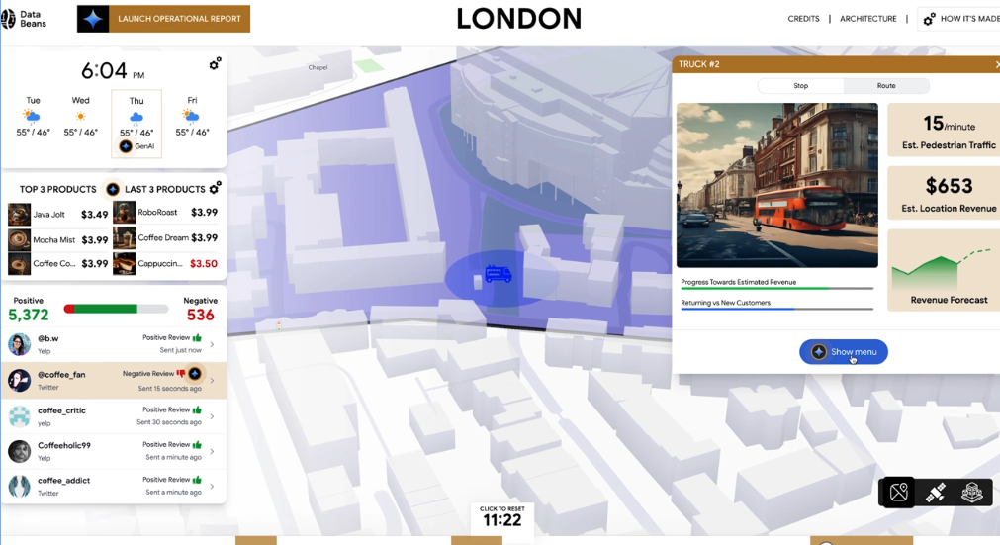
</p>

### AI/ML architecture on Google Cloud
It covers the AI and ML toolbox provided by Google and explains why **Google is a trusted company for AI**. The course is divided into modules that cover different aspects of AI development. The **first module** focuses on the AI foundations, including essential concepts like compute and storage, as well as data and AI products. The **second module** explores various AI development options, such as pre-built APIs, low or no-code solutions like AutoML, and custom training. The **third module** guides you through the AI development workflow using Vertex AI, an end-to-end AI development platform. It also teaches you how to automate the workflow using the Vertex AI pipelines SDK. The **final module** introduces generative AI, its tools, and how it can enhance AI solutions. Throughout the course, Google's commitment to responsible AI is emphasized, with principles that prioritize ethical considerations, fairness, accountability, safety, and transparency. Whether you're a data scientist, ML engineer, or AI developer, this course provides a comprehensive toolbox for your AI and ML projects on Google Cloud.
<p style="text-align: center;">
  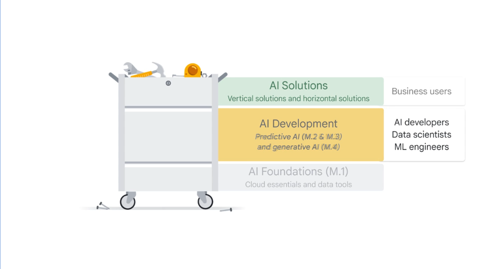
</p>

### Google Cloud infrastructure
Google Cloud infrastructure is divided into three layers: **networking and security, compute and storage, and data and AI/machine learning products**. The **compute layer** includes services like Compute Engine, Google Kubernetes Engine, App Engine, Cloud Run, and Cloud Run functions. These services provide flexible and scalable compute power for running data and AI jobs. The **storage layer** offers fully managed database and storage services such as Cloud Storage, Cloud Bigtable, Cloud SQL, Cloud Spanner, Firestore, and BigQuery. These services cater to different data types and business needs. Google also introduced the Tensor Processing Unit (**TPU**) in 2016, which is a custom-developed hardware specifically designed to accelerate machine learning workloads. TPUs are faster and more energy-efficient than traditional CPUs and GPUs. Compute and storage are decoupled in Google Cloud, allowing them to scale independently.
<p style="text-align: center;">
  
  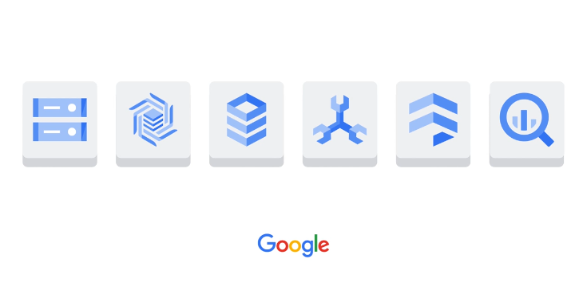
  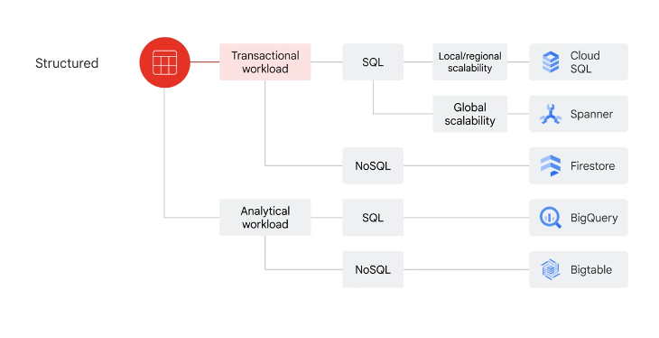
</p>

### Data and AI products
In this lesson, we explore the primary data and AI products on Google Cloud. These products can be divided into four categories along the data to **AI workflow**: ingestion and process, data storage, analytics, and AI and machine learning. 

1. Ingestion and Process:
- Pub Sub: Used to digest both real-time and batch data.
- Data Flow: Helps process and analyze data in real-time.
- Data PC: A data processing service for building and managing data pipelines.
- Cloud Data Fusion: Allows you to create, deploy, and manage data integration pipelines.

2. Data Storage:
- Cloud Storage: Saves unstructured data like text, images, audio, and video.
- BigQuery: A fully managed data warehouse for analyzing data through SQL commands.
- Cloud SQL: A fully managed relational database service.
- Spanner: A globally distributed, horizontally scalable, and strongly consistent relational database service.
- BigTable: A NoSQL database service for large analytical and operational workloads.
- Firestore: A NoSQL document database for building web, mobile, and server applications.

3. Analytics:
- BigQuery: A powerful analytics tool that allows you to analyze data through SQL commands.
- Looker: A family of business intelligence tools for visualizing, analyzing, modeling, and governing business data.

4. AI and Machine Learning:
- Vertex AI: A unified platform that includes multiple tools for AI development, such as AutoML for predictive AI, Workbench and Colab Enterprise for coding, and Vertex AI Studio and Model Garden for generative AI.
- AI Solutions: Built on the ML development platform, these solutions include technologies like document AI, Contact Center AI, Vertex AI Search, and Data Engine.

These products are seamlessly connected on Google Cloud, making it easy for data scientists and AI developers to transition from data to AI. They unlock insights that only large amounts of data can provide and offer generative AI capabilities to enhance their functionality.

<p style="text-align: center;">
  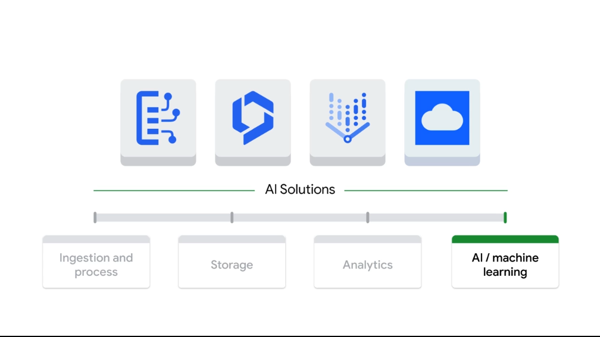
</p>

### ML model categories
This course on Introduction to AI and Machine Learning on Google Cloud covers the following key points:

- Artificial intelligence (AI) is a broad term that includes computers mimicking human intelligence, while machine learning (ML) is a subset of AI that allows computers to learn without explicit programming.
- Supervised learning uses labeled data to train ML models, while unsupervised learning uses unlabeled data to discover patterns.
- Supervised learning includes classification (predicting categorical variables) and regression (predicting numerical variables).
- Unsupervised learning includes clustering (grouping similar data points), association (identifying relationships), and dimensionality reduction (reducing the number of features in a dataset).
- Generative AI relies on training extensive models like large language models.
- Deep learning and deep neural networks are subsets of ML that add layers to enable deeper learning.
- ML models such as logistic regression, linear regression, k-means clustering, association rule learning, and principal component analysis are used to solve different ML problems.

By the end of the course, you will have a solid understanding of the different categories of ML models and how they can be applied to real-world scenarios.

<p style="text-align: center;">
  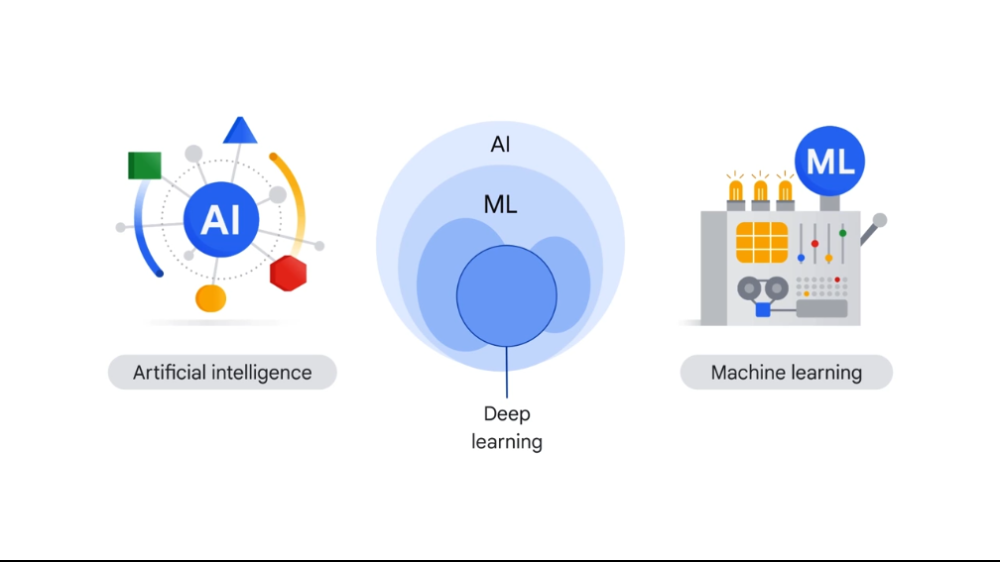
  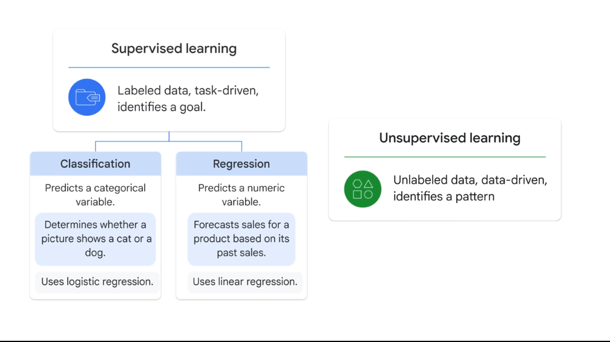
  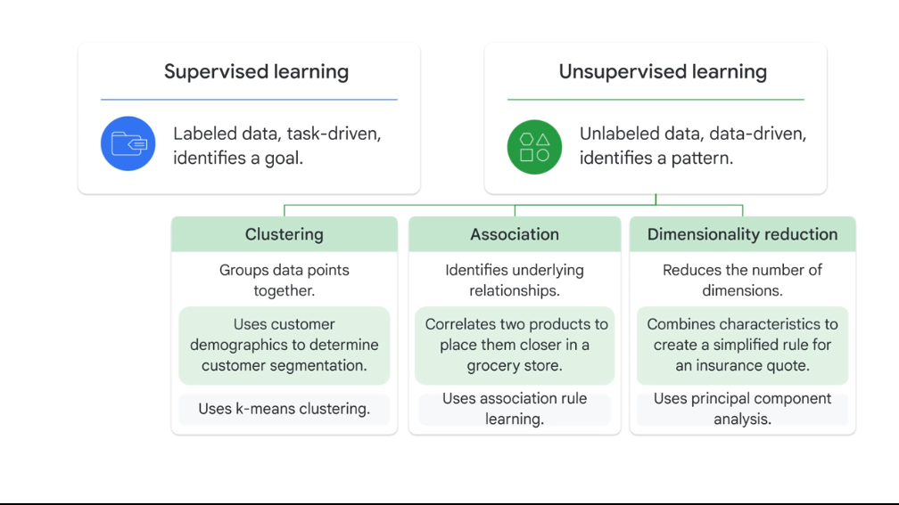
</p>

### BigQuery ML
In this lesson, you will explore BigQuery ML and learn how to build ML models using SQL commands. BigQuery is a powerful data analytics tool on Google Cloud that provides both storage and analytical capabilities. With BigQuery ML, you can manage tabular data and execute ML models in one place with just a few steps. **The process of building an ML model with BigQuery ML involves several phases**:

1. Phase 1: Extract, transform, and load data into BigQuery. You can use connectors to easily import data from other Google products or enrich your existing data warehouse with additional data sources using SQL joins.

2. Phase 2: Select and preprocess features. BigQuery ML helps with preprocessing tasks like one hot encoding of categorical variables, which converts categorical data into numeric data required by the training model.

3. Phase 3: **Create the model inside BigQuery**. You can use the "create model" command to specify the model type, such as logistic regression for classification problems. BigQuery ML supports other popular ML models like linear regression, k-means clustering, and time series forecasting.

4. Phase 4: **Evaluate the performance** of the trained model using the "ML evaluate" query. You can specify evaluation metrics like accuracy, precision, and recall to assess the model's performance on an evaluation dataset.

5. Phase 5: Once you are satisfied with the model's performance, you can use it to **make predictions using the "ML predict"** command. This will return predictions and the model's confidence in those predictions.

BigQuery ML also supports ML Ops, which helps with deploying, monitoring, and managing ML models. It is recommended to start with simpler models like logistic regression and linear regression before exploring more complex models like deep neural networks. By using BigQuery ML, you can streamline the ML workflow and save time and resources in building and training ML models.
<p style="text-align: center;">
  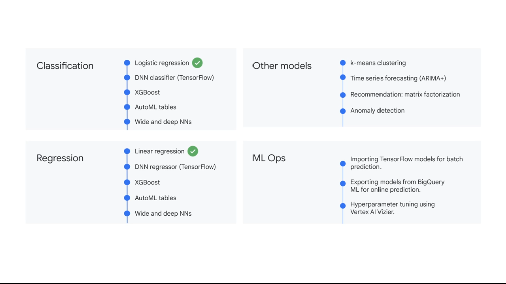
</p>


### Lab: Prediction visitor with BigQuery ML
Problems with Qwiklabs

### Summary
Sure! In the AI Foundations module of the course, you learned about the basics of AI and ML on Google Cloud. Here is a summary of the key topics covered:

1. Introduction to AI Foundations:
- The module started with the story of "coffee on wheels" to demonstrate how AI enables business processes and transformation.
- You were introduced to the three layers of the AI and ML toolbox on Google Cloud: AI foundations, AI development, and AI solutions.
- This module focuses on the AI development layer, which covers both predictive AI and generative AI.

2. Google Cloud Infrastructure:
- You explored the Google Cloud infrastructure, specifically compute and storage.
- Google Cloud decouples compute and storage, allowing them to scale independently based on need.

3. Data and AI Products:
- You learned about the data and AI products offered by Google Cloud.
- These products enable you to perform tasks such as data ingestion, storage, analytics, and AI/ML.

4. Fundamental ML Concepts:
- You delved into the fundamental concepts of machine learning (ML).
- You learned about the categories of ML models, specifically supervised and unsupervised learning.
- These concepts help you choose the right ML model and follow the steps to build an ML model using BigQuery ML.

5. Hands-on Lab:
- You had a hands-on lab where you applied the steps to build your own ML model using SQL commands.
- This practical exercise allowed you to put your knowledge into practice.

That concludes the overview of the AI Foundations module. In the next module, you will advance to AI development and explore different options to build AI and ML projects.

## Module 2: AI Development Options
This module explores the various options for developing an ML project on Google Cloud, from ready-made solutions like **pre-trained APIs, to no-code and low-code solutions like AutoML, and code-based solutions like custom training**. It compares the advantages and disadvantages of each option to help decide the right development tools.
Learning Objectives
* Define different options to build an ML model on Google Cloud.
* Recognize the primary features and applicable situations of **pre-trained APIs, AutoML, and custom training**.
* Use the Natural Language API to analyze text.

### Introduction
In this section of the course, you will learn about AI development options on Google Cloud. You will explore different approaches to building machine learning models, including pre-made APIs, low-code and no-code options, and custom training. You will also be introduced to Vertex AI, Google's unified platform for building ML models, and AutoML, a tool for automating the ML development process. Finally, you will have a hands-on practice using the natural language API to analyze sentiment in text. Let's get started!

### AI development options
In this section, we explore the different AI development options offered by Google Cloud. These options include pre-trained APIs, BigQuery ML, AutoML, and custom training. We compare the pros and cons of each option to help you decide which one is best suited for your business needs and ML expertise. Pre-trained APIs are ready-to-use models that address common perceptual tasks such as vision, video, and natural language. BigQuery ML allows you to use SQL queries to build predefined ML models if you already have data in BigQuery. AutoML is a no-code solution that helps you build your own ML models on Vertex AI through a point-and-click interface. Custom training gives you full control over the ML workflow and allows you to train and serve custom models with code. The best option depends on your specific requirements, ML expertise, and budget.

<p style="text-align: center;">
  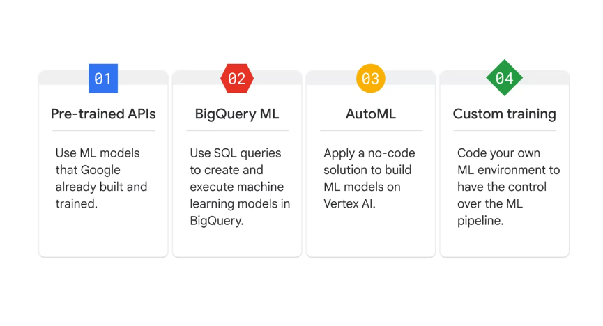
</p>

### Pre-trained APIs
Sure! In this section of the course, we learn about pre-trained APIs and how they can be used in AI development. Here is a summary of the key points:

1. Pre-trained APIs: Pre-trained APIs are services provided by Google Cloud that act as building blocks for AI applications. They save time and effort by providing ready-to-use AI models without the need to train your own models or provide training data.

2. Types of Pre-trained APIs: Google Cloud offers various pre-trained APIs for different purposes:
   - Speech, text, and language APIs: These APIs can derive insights from text, recognize entities and sentiment, and perform language analysis.
   - Image and video APIs: These APIs can recognize content in images and videos, and analyze motion and action in videos.
   - Document and data APIs: These APIs can process documents, extract text, and parse forms.
   - Conversational AI APIs: These APIs can build conversational interfaces.

Remember, pre-trained APIs are a convenient way to leverage AI capabilities without the need for extensive training data or model development. They can be used to solve various business problems and enhance your applications with AI capabilities.
<p style="text-align: center;">
  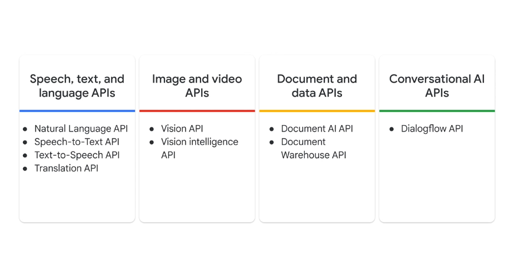
  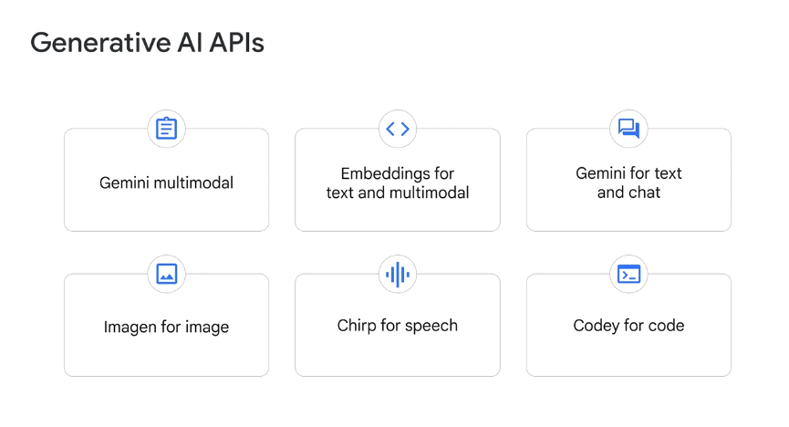
</p>

### Vertex AI
In this lesson, you'll explore Vertex AI, which is the unified platform that supports various technologies and tools on Google Cloud to help you build an ML project from end to end. Google has invested time and resources into developing Data and AI technologies and products, and Vertex AI is their solution to the challenges faced in ML projects. It provides an end-to-end ML pipeline, allowing users to prepare data, create, deploy, and manage models at scale. Vertex AI encompasses both predictive AI and generative AI, offering AutoML for a no-code solution and custom training for more control. The platform is seamless, scalable, sustainable, and speedy, making it easier for data scientists to focus on solving business problems. Additionally, Vertex AI provides tools for generative AI, allowing users to generate content and embed generative AI into their applications.

<p style="text-align: center;">
  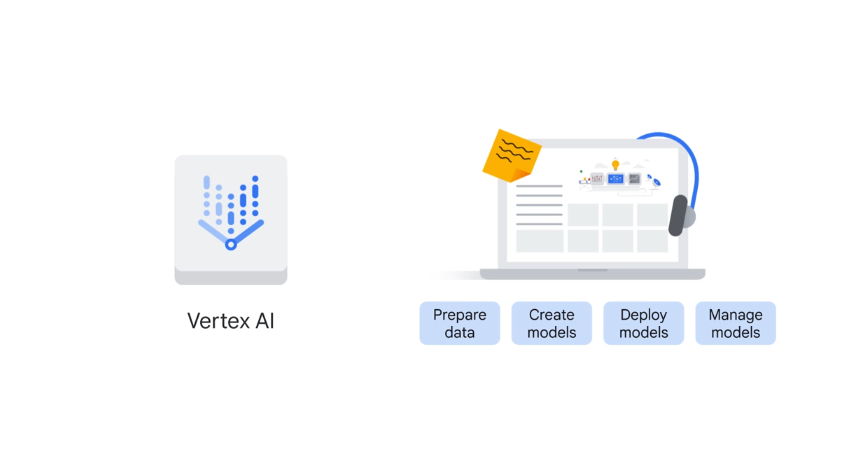
</p>

### AutoML
AutoML is a powerful tool that automates the process of developing and deploying machine learning models. It saves time by automating tasks such as data preprocessing, model selection, and parameter tuning. AutoML is powered by the latest research from Google and consists of four phases: data processing, model search and parameter tuning, model assembly, and prediction preparation. Two key technologies, transfer learning and neural architecture search, support the model search and tuning process. Transfer learning allows models to leverage pre-trained models to achieve high accuracy with less data and computation time. Neural architecture search helps find optimal models by trying different architectures and comparing their performance. AutoML assembles the best models and prepares them for prediction. The best feature of AutoML is that it provides a no-code solution, allowing users to build ML models through a user interface.

<p style="text-align: center;">
  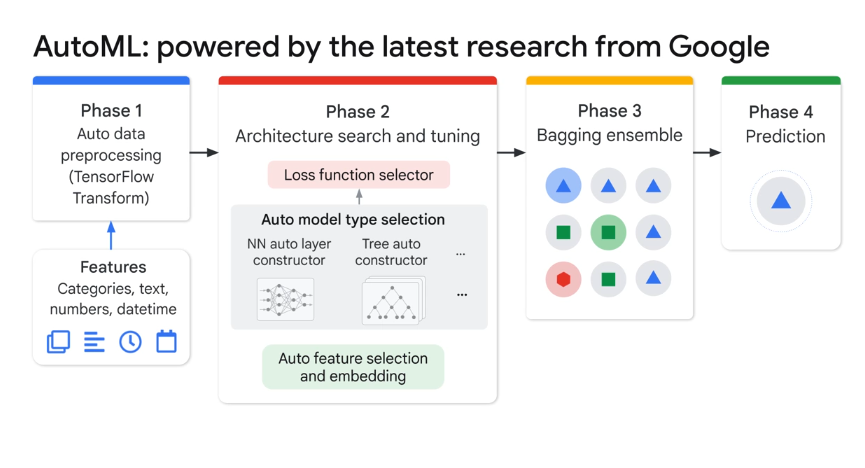
</p>

### Custom training
In this section, we explore the concept of custom training in machine learning. Custom training allows you to create your own machine learning environment and build your own pipeline. You have two options for the environment: a pre-built container or a custom container. A pre-built container is like a furnished kitchen with all the necessary tools, while a custom container is like an empty room where you define the tools you prefer to use.

To code your machine learning model, you can use Vertex AI Workbench, which is a development environment that supports the entire data science workflow. Another option is Colab Enterprise, which provides a familiar coding environment. You can leverage ML libraries like TensorFlow, Scikit-learn, and PyTorch to save time and effort in building your models.

TensorFlow is an end-to-end open platform for machine learning supported by Google. It has multiple abstraction layers, with high-level APIs like Keras that hide the details of machine learning building blocks. TensorFlow can run on different hardware platforms, including CPU, GPU, and TPU.

We also briefly mentioned JAX, a high-performance numerical computation library that offers new possibilities for research and production environments.

<p style="text-align: center;">
  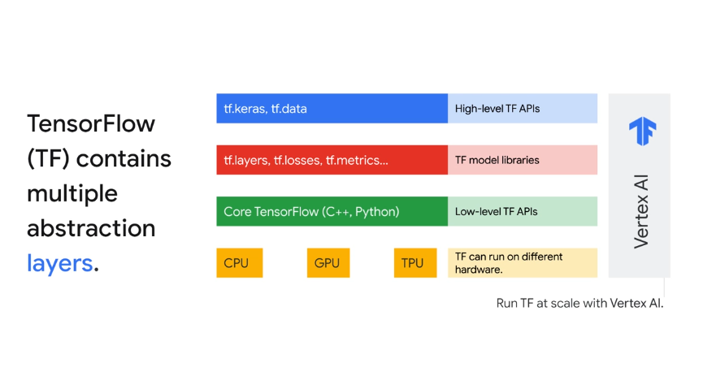
</p>

### Lab Introduction
In this course module, you will learn about using the Natural Language API to analyze texts. You will explore various features of the API, such as identifying entities, analyzing sentiment, analyzing syntax, and classifying text. The API allows you to make requests for different types of analysis and provides JSON responses. You can call the API using tools like curl or programming languages like Python and Java. The responses can be reviewed or parsed for further usage. By completing the lab exercises, you will gain hands-on experience in creating API requests and performing entity extraction, sentiment analysis, and linguistic analysis on text. 

<p style="text-align: center;">
  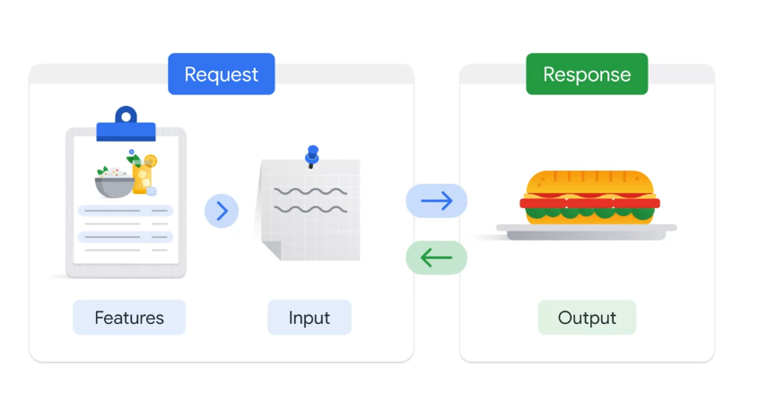
  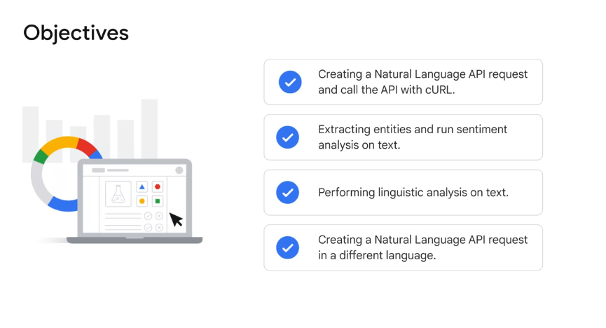
</p>

### Lab: Entity and sentiment analysis with natural language API
#### Task 1. Create an API key
```
export API_KEY=<YOUR_API_KEY>
```
#### Task 2. Make an entity analysis request
```
{
  "document":{
    "type":"PLAIN_TEXT",
    "content":"Joanne Rowling, who writes under the pen names J. K. Rowling and Robert Galbraith, is a British novelist and screenwriter who wrote the Harry Potter fantasy series."
  },
  "encodingType":"UTF8"
}
```
#### Task 3. Call the Natural Language API
```
curl "https://language.googleapis.com/v1/documents:analyzeEntities?key=${API_KEY}" \
  -s -X POST -H "Content-Type: application/json" --data-binary @request.json > result.json
```
For each entity in the response, you get the entity type, the associated Wikipedia URL if there is one, the salience, and the indices of where this entity appeared in the text. Salience is a number in the [0,1] range that refers to the centrality of the entity to the text as a whole.

#### Task 4. Sentiment analysis with the Natural Language API
```
curl "https://language.googleapis.com/v1/documents:analyzeSentiment?key=${API_KEY}" \
  -s -X POST -H "Content-Type: application/json" --data-binary @request.json
  ```
- score - is a number from -1.0 to 1.0 indicating how positive or negative the statement is.
- magnitude - is a number ranging from 0 to infinity that represents the weight of sentiment expressed in the statement, regardless of being positive or negative.

#### Task 5. Analyzing entity sentiment
In addition to providing sentiment details on the entire text document, the Natural Language API can also break down sentiment by the entities in the text. Use this sentence as an example:
- I liked the sushi but the service was terrible.
```
curl "https://language.googleapis.com/v1/documents:analyzeEntitySentiment?key=${API_KEY}" \
  -s -X POST -H "Content-Type: application/json" --data-binary @request.json
```
You can see that the score returned for "sushi" was a neutral score of 0, whereas "service" got a score of -0.7. Cool! You also may notice that there are two sentiment objects returned for each entity. If either of these terms were mentioned more than once, the API would return a different sentiment score and magnitude for each mention, along with an aggregate sentiment for the entity.
#### Task 6. Analyzing syntax and parts of speech


```
curl "https://language.googleapis.com/v1/documents:analyzeSyntax?key=${API_KEY}" \
  -s -X POST -H "Content-Type: application/json" --data-binary @request.json
  ```

Use syntactic analysis, another of the Natural Language API's methods, to dive deeper into the linguistic details of the text. analyzeSyntax extracts linguistic information, breaking up the given text into a series of sentences and tokens (generally, word boundaries), to provide further analysis on those tokens. For each word in the text, the API tells you the word's part of speech (noun, verb, adjective, etc.) and how it relates to other words in the sentence (Is it the root verb? A modifier?).

#### Task 7. Multilingual natural language processing
```
{
  "document":{
    "type":"PLAIN_TEXT",
    "content":"日本のグーグルのオフィスは、東京の六本木ヒルズにあります"
  }
}
```

### Summary
In the AI Development Options module, you learned about different approaches to AI development. Here's a summary:

- Ready-made Approach: Use pre-trained APIs for tasks like image recognition and sentiment analysis.
- Low-code and No-code Approach: Utilize Vertex AI and AutoML for automated ML development without coding.
- Do-it-yourself Approach: Code ML projects using Python, TensorFlow, and Vertex AI workbench.
- Hands-on practice with the Natural Language API.

Next, you'll explore the AI Development Workflow module.

### Reading
AI  development  options:

-  [Natural  Language  API  basics](https://cloud.google.com/natural-language/docs/basics)
-  [AI  APIs  for  Google  Cloud](https://cloud.google.com/ai/apis?hl=en)
-  [Introduction  to  Ve ex  AI](https://cloud.google.com/vertex-ai/docs/start/introduction-unified-platform) 
    - [AutoML Beginner's guide](https://cloud.google.com/vertex-ai/docs/beginner/beginners-guide)
    - [Custom training: beginner guide](https://cloud.google.com/vertex-ai/docs/start/training-guide)
- [Tf.keras  documentation](https://www.tensorflow.org/api_docs/python/tf/keras)

## Module 3: AI Development Workflow
This module walks through the **ML workflow** from data preparation, to model development, and to model serving on Vertex AI. It also illustrates how to convert the workflow into an automated pipeline using Vertex AI Pipelines.
Learning Objectives
* Define the workflow of building an ML model.
* Describe MLOps and workflow automation on Google Cloud.
* Build an ML model from end to end by using AutoML on Vertex AI.

### Introduction
In this section of the course, you will learn about developing an AI project on Google Cloud. The module covers the ML workflow and how to create an automated pipeline. It starts with an overview of the ML workflow, including data preparation, model development, and model serving. You will also learn about machine learning operations (MLOps) and how it takes ML models from development to production. The module includes an example of building a pipeline to automate the training, evaluation, and deployment of an ML model using Vertex AI pipelines. Finally, there is a hands-on lab where you will walk through the three stages of building an ML model with AutoML on Vertex AI.

### ML workflow
In this section of the course, we explore the ML workflow and its main stages. The ML workflow is similar to serving food in a restaurant, starting with **data preparation**, followed by **model development**, and ending with **model serving**. Data preparation involves uploading data and performing feature engineering. Model development requires iterative training to train and evaluate the model. Model serving involves deploying and monitoring the model for predictions. The ML workflow is not linear but **iterative**, allowing for adjustments and improvements. There are two options to set up the workflow with Vertex AI: **AutoML**, a no-code solution, and coding with **Vertex AI Workbench or Colab** using Vertex AI Pipelines. AutoML is user-friendly and doesn't require coding skills, while coding the workflow is suitable for experienced ML engineers or data scientists.

<p style="text-align: center;">
  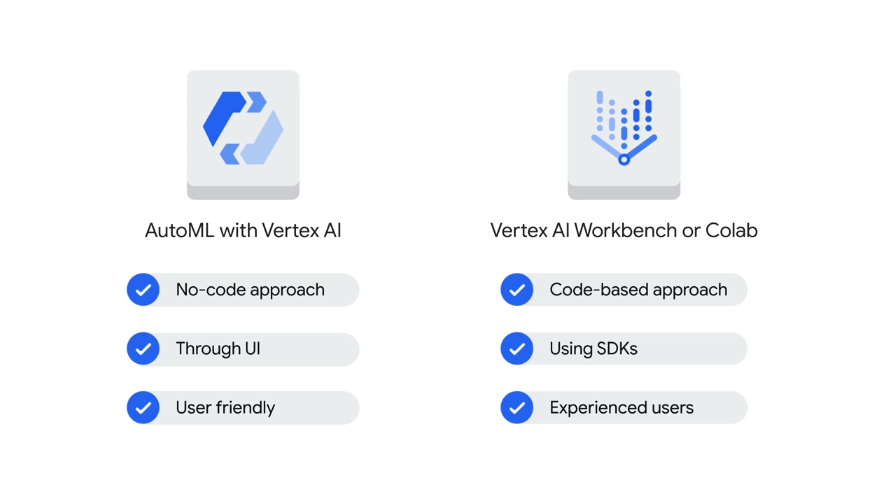
</p>

### Data preparation
Sure! In this section, we learn about the first stage of the ML workflow, which is data preparation. We explore the different types of data that **AutoML supports**, such as **image, tabular, text, and video data**. For each data type, AutoML can solve different types of problems called objectives. For example, with image data, we can train the model to classify images, detect objects, and perform image segmentation. With tabular data, we can solve regression, classification, and forecasting problems. Text data can be used to classify text, extract entities, and conduct sentiment analysis. And finally, video data can be used to recognize video actions, classify videos, and track objects.

We also learn about the concept of **feature engineering**, which is the process of preparing the data for model training. Just like preparing ingredients before cooking a meal, we need to process the data before the model starts training. Features are factors that contribute to the prediction, and feature engineering involves creating and selecting the right features for the model. To help with feature engineering, Vertex AI provides a service called **Vertex AI Feature Store**, which is a centralized repository to manage, serve, and share features. The feature store makes it easy to maintain consistency, save time, and scale the process with low latency.

The benefits of using Vertex AI Feature Store include the ability to share and reuse features, scalability for low latency serving, and an easy-to-use interface. Overall, **AutoML and Vertex AI Feature Store** are powerful tools that can help us solve complex business problems by combining different data types and objectives.

<p style="text-align: center;">
  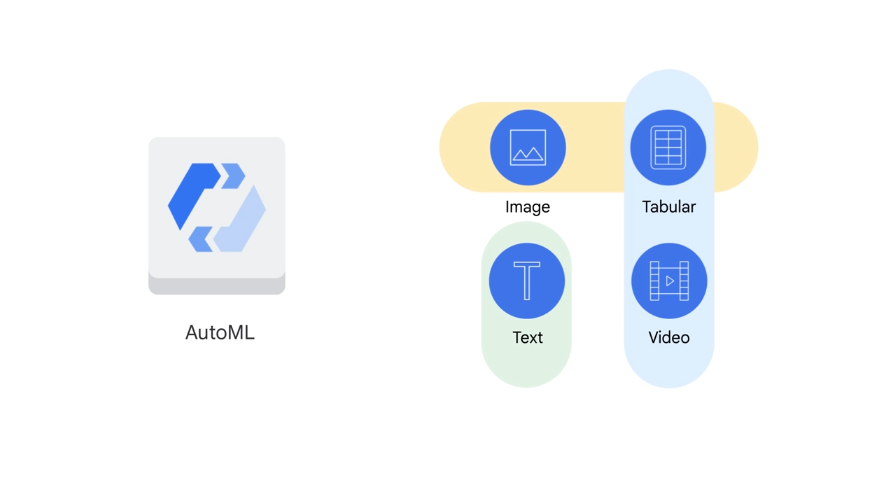
</p>

### Model development
In the second stage of model development, you train the model and evaluate the results. This involves two steps: **model training and model evaluation**. During model training, you specify the training method, such as AutoML or custom training, and determine the training details, such as the target column and training options. Once the model is trained, you evaluate its performance using metrics like **recall and precision**, which are measured using a confusion matrix. Recall measures how many positive cases were predicted correctly, while precision measures how many predicted positive cases are actually positive. These metrics help you understand the model's performance and make adjustments if needed. Additionally, Vertex AI provides **feature importance**, which shows how each feature contributes to the prediction. This information helps you decide which features to include in the model. Overall, the goal is to develop a model that performs well and accurately predicts the desired outcome.

<p style="text-align: center;">
  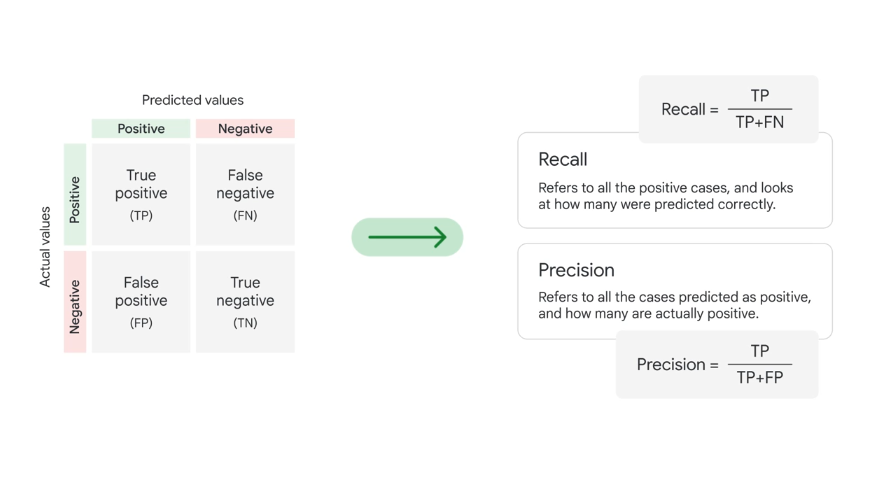
  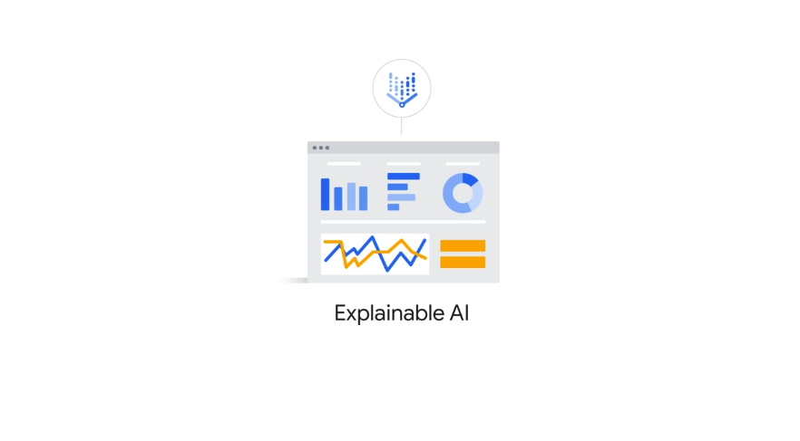
</p>

### Model serving
In this section of the course, we focus on the third stage of the machine learning workflow, which is model serving. Model serving consists of two steps: **model deployment and model monitoring**. 

**Model deployment** is the process of implementing and making the model ready to serve predictions. There are two primary options for deploying a model: deploying it to an **endpoint** for real-time predictions or requesting a prediction job directly from the model resource for **batch prediction**. The choice depends on whether immediate results with low latency are needed or if no immediate response is required.

**Model monitoring** is crucial to ensure the performance of the deployed model. It involves monitoring the model's predictions and performance to ensure that it is operating efficiently. **Vertex AI Pipelines** is a tool kit that automates and monitors machine learning systems by orchestrating the workflow in a serverless manner. It displays production data and triggers warnings if something goes wrong based on pre-defined thresholds.

Overall, model deployment and model monitoring are the final steps in the machine learning workflow, where the model is implemented and begins making predictions or generating content. These steps ensure that the model is serving its purpose effectively.

### MLOps and workflow automation
In this lesson, you learned about MLOps and workflow automation. MLOps combines machine learning development with operations and applies principles from DevOps to machine learning models. The backbone of MLOps on Vertex AI is a toolkit called **Vertex AI Pipelines**, which supports **Kubeflow Pipelines** and **TensorFlow Extended**. An ML pipeline consists of processes that run in different environments, including data preparation, model development, and model serving. Each process can be a pipeline component, which is a self-contained set of code that performs a specific task. You can build custom components or use pre-built components provided by Google. Organizations often implement ML **automation in three phases**: Phase 0, where you manually build an end-to-end workflow; Phase 1, where you automate the workflow by building components; and Phase 2, where you integrate the components to achieve continuous integration, training, and delivery. You can use **templates** provided by Vertex AI to start building your pipeline. Once the pipeline is built, you can compile and run it. The pipeline will constantly check the performance of the model and decide whether it should be deployed or retrained without your intervention.

<p style="text-align: center;">
  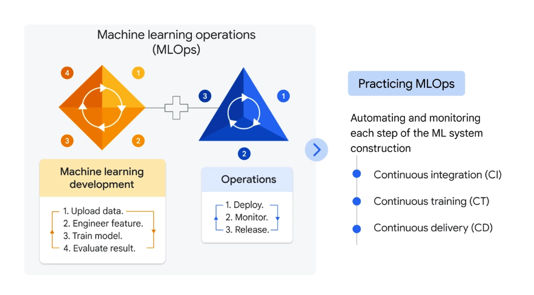
  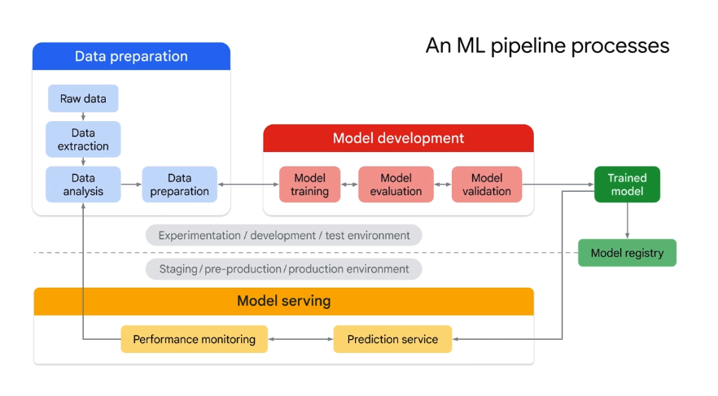
</p>
    
### Lab introduction
In this section of the course, we will be putting our knowledge into practice with a hands-on lab using AutoML, a no-code tool for building machine learning models. The lab focuses on **predicting loan risk** using a dataset from a financial institution. We will go through the three phases of the machine learning workflow: data preparation, model development, and model serving. Before starting the lab, we will **review the concept of model evaluation, specifically the confusion matrix**. We will also discuss the **precision-recall curve** and the importance of setting an appropriate threshold for your model. Let's get started!

<p style="text-align: center;">
  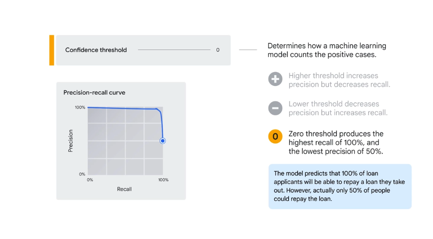
  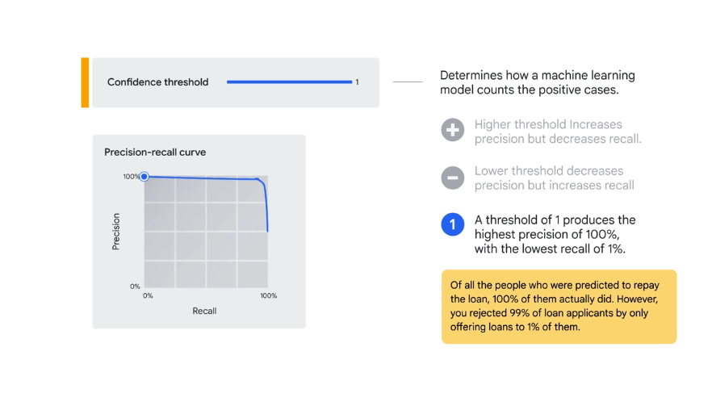
</p>

### How a machine learns

### Lab Vertex AI: Prediction Loan Risk with AutoML
Objectives
You learn how to:
- Upload a dataset to Vertex AI.
- Train a machine learning model with AutoML.
- Evaluate the model performance.
- Deploy the model to an endpoint.
- Get predictions.

#### Introduction to Vertex AI
This lab uses Vertex AI, the unified AI platform on Google Cloud to train and deploy a ML model. Vertex AI offers two options on one platform to build a ML model: a codeless solution with AutoML and a code-based solution with Custom Training using Vertex Workbench. You use AutoML in this lab.

In this lab you build a ML model to determine whether a particular customer will repay a loan.

#### Task 1. Prepare the training data
There are three options to import data in Vertex AI:

- Upload CSV files from your computer.
- Select CSV files from Cloud Storage.
- Select a table or view from BigQuery.

#### Task 2. Train your model
- Training method
- Model details
- Training options
- Compute and pricing

#### Task 3. Evaluate the model performance (demonstration only)
Vertex AI provides many metrics to evaluate the model performance. You focus on three:

- Precision/Recall curve
- Confusion Matrix
- Feature Importance

#### Task 4. Deploy the model (demonstration only)
Now that you have a trained model, the next step is to create an endpoint in Vertex. A model resource in Vertex can have multiple endpoints associated with it, and you can split traffic between endpoints.
- Create and define an endpoint
- Model settings and monitoring

#### Task 5. SML Bearer Token
- Retrieve your Bearer Token

To allow the pipeline to authenticate, and **be authorized to call the endpoint to get the predictions**, you will need to provide your Bearer Token.

#### Task 6. Get predictions
- Open cloud shell windows
- export **AUTH_TOKEN**="INSERT_SML_BEARER_TOKEN"

gcloud storage cp: Copy data between your local file system and the cloud, within the cloud, and between cloud storage providers.
- gcloud storage cp gs://spls/cbl455/cbl455.tar.gz .
- tar -xvf cbl455.tar.gz
- export **ENDPOINT**="https://sml-api-vertex-kjyo252taq-uc.a.run.app/vertex/predict/tabular_classification"
- export **INPUT_DATA_FILE**="INPUT-JSON" 

> The smlproxy application is used to communicate with the backend.

The file INPUT-JSON is composed of the following values:
age	ClientID	income	loan
40.77	997	44964.01	3944.22

```python
./smlproxy tabular \
  -a $AUTH_TOKEN \
  -e $ENDPOINT \
  -d $INPUT_DATA_FILE
```
Response
```python
 SML Tabular HTTP Response:
  2022/01/10 15:04:45 {"model_class":"0","model_score":0.9999981}
```
If you use the Google Cloud console, the following image illustrates how the same action could be performed:
<p style="text-align: center;">
  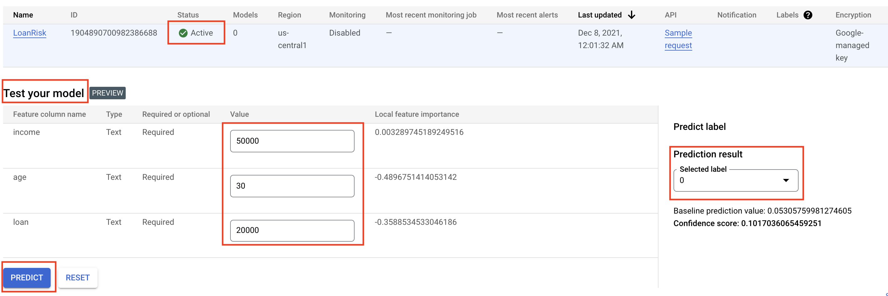
</p>

### Summary
In the AI Development Workflow module, you learned about the three main stages of the machine learning workflow: data preparation, model development, and model serving. Here is a summary of what you learned:

1. Data Preparation:
- In this stage, you uploaded data and applied feature engineering.
- It is similar to gathering ingredients and prepping them in the kitchen for a meal.

2. Model Development:
- In this stage, the model was trained and evaluated.
- You experimented with different recipes and tasted the meal to ensure it turned out as expected.

3. Model Serving:
- In this final stage, the model was deployed and monitored.
- It is like serving the meal to customers and adjusting the menu based on their feedback.

You also learned that there are two ways to build a machine learning model: through a user interface or with code. Using pre-built SDKs with Vertex AI pipelines allows you to automate the ML pipeline for continuous integration, training, and delivery.

Next, you will advance to the Generative AI module, which offers exciting opportunities in AI development.

### Reading
- [MLOps overview](https://cloud.google.com/architecture/mlops-continuous-delivery-and-automation-pipelines-in-machine-learning)
- [Introduction to Vertex AI pipeline](https://cloud.google.com/vertex-ai/docs/pipelines/introduction)
    - [Introduction to Vertex AI pipeline lab](https://codelabs.developers.google.com/vertex-pipelines-intro#0)
    - [Introduction to Vexter AI SDK](https://www.youtube.com/watch?v=VaaUnIFCNX4)
- [Explainable AI](https://cloud.google.com/explainable-ai)
- Course: Introduction to Vertex Forescasting and Time Series in Practice
    - [Coursea](https://www.coursera.org/learn/vertex-forecasting-and-time-series-in-practice)
    - [Google Cloud Skill boost](https://www.cloudskillsboost.google/course_templates/511)

## Module 4: Generative AI
This module introduces generative AI (gen AI), the newest advancement in AI, and the essential toolkits for developing gen AI projects. It starts by examining the gen AI workflow on Google Cloud. It then investigates how to use Gen AI Studio and Model Garden to access Gemini multimodal, design prompt, and tune models. Finally, it explores the built-in gen AI capabilities of AI solutions.
Learning Objectives
* Define generative AI and foundation models.
* Use Gemini multimodal with Vertex AI Studio.
* Design efficient prompt and tune models with different methods.
* Recognize the AI solutions and the embedded Gen AI features.

### Introduction
In this module on Generative AI, you will explore the exciting opportunities offered by this recent AI innovation. You will learn about GenAI and how it functions, create GenAI projects on Google Cloud, and use Gemini multimodal with Vertex AI Studio. You will also delve into prompt design, model tuning, and explore Model Garden for accessing different GenAI models. Additionally, you will discover how GenAI is integrated into AI solutions like CCAI. The module concludes with a hands-on lab using Vertex AI Studio to create prompts and conversations. By the end, you will have a solid understanding of Generative AI and the tools available for GenAI development. Let's get started!
### Generative AI and workflow
### Gemini multimodal
### Promt design
### Model tuning
### Model Garden
### AI solutions
### Lab introduction
### Lab: Vertex AI studio
### Summary

## Module 5: Summary
