## Module 1: Introduction
### Course introduction
This course, "Launching into Machine Learning," provides foundational knowledge in machine learning. Throughout the course, you will learn about improving **data quality, performing exploratory data analysis, building and training ML models using Vertex AI AutoML and BigQuery ML, optimizing and evaluating models using loss functions and performance metrics, and creating repeatable and scalable training, evaluation, and test datasets**. The course is designed to help you understand the terminology used in machine learning and develop practical skills in applying ML techniques.

## Module 2: Get to Know Your Data: Improve Data throught Exploratory Data Analysis
### Introduction
In this module, we look at how to improve the quality of our data and how to explore our data by performing exploratory data analysis. We look at the importance of tidy data in Machine Learning and show how it impacts data quality. For example, missing values can skew our results. You will also learn the importance of exploring your data. Once we have the data tidy, you will then perform exploratory data analysis on the dataset.
Learning Objectives
- Perform exploratory data analysis.
- Categorize missing data strategies
- Improve data quality

### Improve Data Quality
In this course, you will learn about the two phases of machine learning: the training phase and the inference phase. The course emphasizes the importance of data in machine learning projects and provides steps for delivering an ML model to production. These steps include data extraction, data analysis, and data preparation. Data quality is assessed through measures such as **accuracy, timeliness, and completeness**. The course also covers ways to improve data quality, such as resolving **missing values, converting data types, and using one-hot encoding** for categorical features. Overall, the course highlights the significance of data quality in influencing the predictive value of machine learning models.
<p style="text-align: center;">
  
  
</p>

### Lab Intro: Improve the quality of your data
This lab focuses on improving data quality by addressing common issues of untidy data. The lab covers the following topics:
1. Missing Values:
   - The lab provides solutions for handling missing attribute values in data.
2. Data Feature Conversion:
   - The lab demonstrates how to convert data feature columns to a date time format.
3. Feature Column Renaming:
   - The lab shows how to rename a feature column in the data.
4. Removing Values:
   - The lab explains how to remove a specific value from a feature column.
5. One-Hot Encodings:
   - The lab covers the creation of one-hot encodings, which are useful for representing categorical data in a machine learning model.
6. Temporal Features Conversions:
   - The lab provides examples of converting temporal features, such as dates and times, into a format suitable for machine learning algorithms.

By addressing these issues, the lab helps prepare data for ingestion by machine learning algorithms, ensuring better data quality and more accurate model predictions.

### Lab Demo: Improve the quality of your data
This section of the course focuses on improving data quality. The main topics covered include resolving missing values, converting data feature columns to a data-in format, and creating one hot encoding of categorical features. The lab exercises involve working with a dataset from the California Open Data Portal that contains information about vehicles by zip code. The necessary libraries for the lab include TensorFlow, Pandas, NumPy, Matplotlib, and Seaborn. The dataset is uploaded from a Google Cloud Storage bucket and processed to create a new dataframe with one hot encoding for categorical features. The final dataset is prepared for training models with 53 columns containing numerical and categorical features. The section concludes by emphasizing the importance of data cleaning and preparation before moving on to creating models.


#### Task 1. Set up your environment
#### Task 2. Launch Vertex AI Notebooks instance
#### Task 3. Clone course repo within your Vertex AI Notebooks instance
https://github.com/GoogleCloudPlatform/training-data-analyst.git
#### Task 4. Improve data quality
- Load the dataset
- Read Dataset into a Pandas DataFrame
- DataFrame Column Data Types
- Summary Statistics 
- Checking for Missing Values
- What Are Our Data Quality Issues?
    1. **Data Quality Issue #1**:  
    > **Missing Values**:
    Each feature column has multiple missing values.  In fact, we have a total of 18 missing values.
    2. **Data Quality Issue #2**: 
    > **Date DataType**:  Date is shown as an "object" datatype and should be a datetime.  In addition, Date is in one column.  Our business requirement is to see the Date parsed out to year, month, and day.  
    3. **Data Quality Issue #3**: 
    > **Model Year**: We are only interested in years greater than 2006, not "<2006".
    4. **Data Quality Issue #4**:  
    > **Categorical Columns**:  The feature column "Light_Duty" is categorical and has a "Yes/No" choice.  We cannot feed values like this into a machine learning model.  In addition, we need to "one-hot encode the remaining "string"/"object" columns.
    5. **Data Quality Issue #5**:  
    > **Temporal Features**:  How do we handle year, month, and day?

### What is Exploratory data analysis
Exploratory Data Analysis (EDA) is an approach to analyzing data sets to summarize their main characteristics using visual methods. EDA involves using graphics and basic sample statistics to get a feeling for what information can be obtained from the dataset. The goal of EDA is to obtain theories that can later be tested in the modeling step. EDA techniques are generally graphical and include **scatter plots, box plots, and histograms**. The three popular data analysis approaches are classical analysis, EDA, and Bayesian analysis. Classical analysis imposes a model on the data, while EDA allows the data to suggest admissible models. Bayesian analysis uses probability statements based on prior data to answer research questions about unknown parameters. Data analysts often mix elements of all three approaches in real-world analysis.
-  uncover underlying structure, 
- extract important variables, 
- detect outliers, 
- and anomalies. 
- Test underlying assumptions
- develop parsimonious models
- determine optimal factor settings
-  look at data for trends

<p style="text-align: center;">
  
</p>

### How is EDA used in Machine Learning
This section focuses on how exploratory data analysis (EDA) is used in machine learning. EDA is an approach that allows the data to suggest admissible models that best fit the data, rather than imposing deterministic or probabilistic models on the data. The main goal of EDA is to **understand the data, its structure, outliers, and the models suggested by the data**. 

The section covers two main methods of EDA: univariate analysis and bivariate analysis. 

**Univariate analysis** is the simplest form of analyzing data, where the data has only one variable. It focuses on describing the data, summarizing it, and finding patterns. Categorical data can be analyzed using numerical EDA with the help of pandas' crosstab function and visual EDA using Seaborn's countplot function. Continuous data can be analyzed using pandas' describe function and visualized using boxplots, distribution plots, and kernel density estimation plots (KDE plots) in Python using Matplotlib or Seaborn.

**Bivariate analysis**, on the other hand, involves analyzing the relationship between two sets of values. It helps determine if there is a relationship between variables. Python libraries like Matplotlib and Seaborn can be used to analyze bivariate and multivariate data. Seaborn's conditional plots, such as factor plots and joint plots, are powerful tools for visualizing segmented data and relationships between variables.

<p style="text-align: center;">
  
</p>

### Data analysis and visualization
Exploratory Data Analysis (EDA) is an essential step in the machine learning process. Its purpose is to find insights that will help with data cleaning, preparation, and transformation, which are crucial for building accurate machine learning models. Data analysis and data visualization are used at every step of the machine learning process, including data exploration, data cleaning, model building, and presenting results. Some common visualization techniques used in EDA include **histograms, scatter plots, and heat maps**. The goal of EDA is to gain maximum insight into the dataset, identify outliers or anomalies, and identify the most influential features. There are many ways to explore, analyze, and plot data, so it's important to continue expanding your knowledge in this area.

### Lab introduction: Explore the data using Python and BigQuery
In this course, "Launching into Machine Learning" by Google Cloud, you will learn about exploratory data analysis (EDA) using Python and BigQuery. The course covers various topics such as analyzing pandas data frames, creating Seaborn plots for EDA, writing SQL queries to extract specific fields from BigQuery datasets, and performing EDA in BigQuery. The objective is to help you gain a deeper understanding of your data and improve your machine learning models. Throughout the course, you will have access to course materials and resources to support your learning journey. Let's dive in and explore the world of machine learning!

### Lab: Exploratory data analysis using Python and BigQuery

#### Task 1. Launch Vertex AI Notebooks
#### Task 2. Clone a course repo within your Vertex AI Notebooks instance
```python
git clone https://github.com/GoogleCloudPlatform/training-data-analyst
```
#### Task 3. Exploratory data analysis using Python and BigQuery
- Analyze a Pandas Dataframe
- Create Seaborn plots for Exploratory Data Analysis in Python
- Write a SQL query to pick up specific fields from a BigQuery dataset
- Exploratory Analysis in BigQuery

- Loaded data set
- Inspect the data
- Explore the data
    - heatmap
    - displot
    - scatteplot

In this notebook, we will explore data corresponding to taxi rides in New York City to build a Machine Learning model in support of a fare-estimation tool. The idea is to suggest a likely fare to taxi riders so that they are not surprised, and so that they can protest if the charge is much higher than expected.
- Access and explore a public BigQuery dataset on NYC Taxi Cab rides
- Visualize your dataset using the Seaborn library

```python
%%bigquery
# SQL query to get a fields from dataset which prints the 10 records
SELECT
    FORMAT_TIMESTAMP(
        "%Y-%m-%d %H:%M:%S %Z", pickup_datetime) AS pickup_datetime,
    pickup_longitude, pickup_latitude, dropoff_longitude,
    dropoff_latitude, passenger_count, trip_distance, tolls_amount, 
    fare_amount, total_amount 
# TODO 3
FROM
    `nyc-tlc.yellow.trips`
LIMIT 10
```

### Reading
- [Guide to data Quality Managment](https://www.scnsoft.com/blog/guide-to-data-quality-management)
- [Exploratory Data Analysis with Python](https://www.youtube.com/watch?v=-o3AxdVcUtQ)
- [How to investigate a dataset with Python](https://towardsdatascience.com/hitchhikers-guide-to-exploratory-data-analysis-6e8d896d3f7e)

## Module 3: Machine Learning in Practis
In this module, we will introduce some of the main types of machine learning so that you can accelerate your growth as an ML practitioner.
Learning Objectives
Differentiate between supervised and unsupervised learning
Perform linear regression using Scikit-Learn.
Differentiate between regression and classification problems.

### Supervised Learning
### Linear regrerssion
### Lab Intor: Introduction to Linear Regression
### Lab demo: Intro to Linear Regression
### Lab: Introductionto linear regression
### Logistic regression
### Reading

## Module 4: Trainig AutoML Models using Vertex AI
In this module, we will introduce training AutoML Models using Vertex AI.
Learning Objectives
Define automated machine learning
Train a Vertex AI AutoML regression model.
Explain how to evaluate Vertex AI AutoML models

### Machine Learning vs Deep Learning
In this lesson, we explore the concept of automated machine learning and its distinction from statistics and deep learning. We start by understanding that **machine learning begins** with a business requirement or problem that needs to be solved. We then learn about the process of wrangling data, including resolving missing values, converting data formats, renaming columns, and creating one-hot coding features. Exploratory Data Analysis (EDA) is introduced as a technique to visualize and understand the data. 

We learn about different **machine learning frameworks** such as scikit-learn, PyTorch, and TensorFlow, with a focus on scikit-learn, a Python library for machine learning. We also explore the differences between machine learning and **statistics**, including data preparation, hypothesis testing, and the nature of the data.

Finally, we briefly touch on **deep learning** as a subset of machine learning methods. Deep learning is implemented as supervised learning and requires large datasets for higher accuracy. It also involves training on GPUs and offers more control over hyperparameter tuning.

<p style="text-align: center;">
  
  
</p>

### What is automated machine learning
Automated Machine Learning (AutoML) is the process of applying machine learning to real-world problems in a quicker and more efficient way. **It automates various components of the machine learning workflow, such as data readiness, feature engineering, training and hyperparameter tuning, model serving, explainability and interpretability, and deployment to edge devices**. Vertex AI, a platform by Google Cloud, offers automation for these components and more. Throughout the course series, you will learn about real-world examples of Vertex AI's features, including vizier optimization for hyperparameter tuning, managed datasets, feature store, and more.
<p style="text-align: center;">
  
</p>

### AutoML Regression model
This section of the course material focuses on using Vertex AI to train machine learning models without writing code. It starts by explaining the differences between statistics, machine learning, and deep learning. Then, it introduces a use case where a team at XYZ Company wants to deliver their first ML model to production. The team has structured data and wants to predict a credit score. They can use Vertex AI's AutoML, which allows them to load data, generate statistics, and build and train their model without writing code. The team selects the Tabular data type and regression classification as their objective. They upload their dataset and confirm that the data is loaded correctly. They then train the model using AutoML and receive an email when the training is complete. Vertex AI provides a unified platform that eliminates the need for writing code and allows team members to manage various stages of the ML workflow. AutoML is a codeless solution that requires minimal technical effort, while custom training provides more flexibility and control over the training application. AutoML is recommended for users without data science expertise, while custom training requires programming experience. AutoML also saves time by reducing data preparation and development efforts. The choice between AutoML and custom training depends on the machine learning objectives and the level of control required. Both options have limits on managed datasets, but there is no limit on data size for unmanaged datasets. Vertex AI offers a versatile platform for managing datasets, training models, evaluating accuracy, tuning hyperparameters, and deploying models for serving predictions.

<p style="text-align: center;">
  
  
  
</p>

### Evaluated AutoML Models
In this lesson, we explore ways to evaluate AutoML models, focusing on model **evaluation for structured or tabular data**. The evaluation metrics provide quantitative measurements of how your model performed on the test set. The data set is split into **training, validation, and testing sets**, with the majority of the data in the training set. The validation set is used to tune the model's hyperparameters, while the test set is used to assess the model's performance on new data. We also discuss various **regression metrics**, such as mean absolute error (MAE), root mean square error (RMSE), and R squared. Additionally, we cover **classification metrics** like precision, recall, and F1 score. **Model feature** attributions are examined to understand the impact of each feature on the model. Finally, we learn about using the model for predictions through **batch prediction and online prediction**.
> Endpoints are the machine learning models that are made available for online prediction requests. You can set up endpoints to handle timely predictions for multiple users or in response to application requests.

<p style="text-align: center;">
  
  
  
</p>

### Reading
- [Training AutoML Models](https://cloud.google.com/vertex-ai/docs/training/training)
- [Train an AutoML model - cloud consile](https://cloud.google.com/vertex-ai/docs/training/automl-console)
- [Train an AutoML model (API)](https://cloud.google.com/vertex-ai/docs/training/automl-api)
- [Optimization objectives for tabular AutoML models](https://cloud.google.com/vertex-ai/docs/training/tabular-opt-obj)
- [Train an AutoML Edge model using the Cloud Console](https://cloud.google.com/vertex-ai/docs/training/automl-edge-console)
- [Train an AutoML Edge model using the Ve ex AI API](https://cloud.google.com/vertex-ai/docs/training/automl-edge-api)
- [Evaluate AutoML Models](https://cloud.google.com/vertex-ai/docs/training/evaluating-automl-models)


## Module 5: BigQuery Machine Learning: Develop ML Models Where Your Data Lives

### Introduction
This module focuses on training machine learning models with BigQuery ML. By completing this module, you will be able to:
- Describe BigQuery ML and understand how it supports machine learning models.
- Understand BigQuery ML hyperparameter tuning.
- Explain how to build a recommendation system with BigQuery ML.

### Training an ML model using BigQuery ML
This section focuses on the use of BigQuery Machine Learning (BigQuery ML) to develop machine learning models where your data lives. **BigQuery ML is a set of SQL extensions that allow you to perform machine learning tasks directly within Google's BigQuery platform**. It provides an easy and efficient way to build, train, evaluate, and deploy machine learning models using just SQL queries.

Here are the key points covered in this section:

1. **Introduction to BigQuery ML**: BigQuery ML is a middle ground between using pre-trained models and building your own TensorFlow model with the Vertex AI platform. It simplifies the machine learning process by allowing you to work with structured data and write SQL queries to create and train models.

2. **Benefits of BigQuery ML**: BigQuery ML offers several advantages. It speeds up the time to production by automating many steps in the machine learning workflow. It eliminates the need to move and format large amounts of data for Python-based ML frameworks. It also makes development work faster, especially for team members familiar with SQL.

3. **Data Requirements**: BigQuery ML is suitable for structured data sets larger than 100 gigabytes and containing fewer than 1,000 rows. The target column must be categorical or numerical. If the data set size or structure does not meet these requirements, other options like custom Python frameworks may be more appropriate.

4. **Building a Model with BigQuery ML**: To build a model in BigQuery ML, you need to write a SQL query to extract the training data from BigQuery. Then, you create a model by specifying the model type and options. You can evaluate the model's performance and make predictions using SQL functions provided by BigQuery ML.

By leveraging BigQuery ML, teams can develop machine learning models efficiently and effectively within the BigQuery platform, **without the need for extensive coding or data movement**.

<p style="text-align: center;">
  
  
  
</p>

### BigQuery Machine Learning supported models
BigQuery supports various model types for classification and regression. For binary classification, you can use logistic regression, while for multi-class classification, you can use logistic regression with BigQuery ML. Linear regression is used for regression problems when the label is a number. TensorFlow-based DNN (Deep Neural Network) models can be used for both regression and classification problems. Boosted decision trees are preferred over regular decision trees for better performance on extensive datasets. Matrix factorization is used for creating recommendation systems. K-means clustering is used when labels are unavailable, such as for customer segmentation. BigQuery ML for time series is popular for estimating future demands and automatically detecting anomalies. AutoML Tables is a tool that automatically searches for the best model for regression, classification, and time series forecasting problems. TensorFlow model importing allows you to import previously trained TensorFlow models to BigQuery for predictions.

<p style="text-align: center;">
  
</p>

### Lab Intro: Using BigQuery ML to predict pinguin weight
This lab focuses on using BigQuery ML to create a model that predicts the weight of a penguin based on various features. The lab provides a hands-on introduction to using BigQuery ML, evaluating the ML model, and making predictions using the ML model.

### Lab Demo: Using BigQuery ML to predict inpguin weight
In this section of the course, we learn about BigQuery Machine Learning (BQML) and how to develop machine learning models using BQML. The instructor starts by explaining how to **create a dataset in BigQuery** and then proceeds to create a linear regression model using the penguins dataset. The instructor demonstrates how to train the model and evaluate its performance using different **performance metrics**. They also show how to use the model to make predictions and compare the predicted values with the actual values. Additionally, the instructor introduces the concept of explainable AI and demonstrates how to use the ML explain predict function to understand the feature attributions of the model. Finally, they explain how to use the **ML Global explained function** to determine the most important features for predicting the weight of a penguin.

### Lab: Using BigQuery ML to predict penguin weight

#### Task 1. Create your dataset
#### Task 2. Create your model
```
#standardSQL
CREATE OR REPLACE MODEL `bqml_tutorial.penguins_model`
OPTIONS
  (model_type='linear_reg',
    input_label_cols=['body_mass_g']) AS
SELECT
  *
FROM
  `bigquery-public-data.ml_datasets.penguins`
WHERE
  body_mass_g IS NOT NULL
```
#### Task 3. Get training statistics (Optional)
The Training Data Loss column represents the loss metric calculated after the model is trained on the training dataset. Because you performed a linear regression, this column is the mean squared error.

#### Task 4. Evaluate your model
A proper evaluation would be on a subset of the penguins table that is separate from the data used to train the model. You can also call ML.EVALUATE without providing the input data. ML.EVALUATE will retrieve the evaluation metrics calculated during training, which uses the automatically reserved evalution dataset:
```
#standardSQL
SELECT
  *
FROM
  ML.EVALUATE(MODEL `bqml_tutorial.penguins_model`,
    (
    SELECT
      *
    FROM
      `bigquery-public-data.ml_datasets.penguins`
    WHERE
      body_mass_g IS NOT NULL))
```

An important metric in the evaluation results is the R2 score. The R2 score is a statistical measure that determines whether the linear regression predictions approximate the actual data. 0 indicates that the model explains none of the variability of the response data around the mean. 1 indicates that the model explains all the variability of the response data around the mean.

#### Task 5. Use your model to predict outcomes
```
#standardSQL
  SELECT
    *
  FROM
    ML.PREDICT(MODEL `bqml_tutorial.penguins_model`,
      (
      SELECT
        *
      FROM
        `bigquery-public-data.ml_datasets.penguins`
      WHERE
        body_mass_g IS NOT NULL
        AND island = "Biscoe"))
```

#### Task 6. Explain prediction results with explainable AI methods

To understand why your model is generating these prediction results, you can use the ML.EXPLAIN_PREDICT function.

ML.EXPLAIN_PREDICT is an extended version of ML.PREDICT. ML.EXPLAIN_PREDICT returns prediction results with additional columns that explain those results.

You can run ML.EXPLAIN_PREDICT without ML.PREDICT. For an in-depth explanation of Shapley values and explainable AI in BigQuery ML, see BigQuery ML explainable AI overview.

```
#standardSQL
SELECT
*
FROM
ML.EXPLAIN_PREDICT(MODEL `bqml_tutorial.penguins_model`,
  (
  SELECT
    *
  FROM
    `bigquery-public-data.ml_datasets.penguins`
  WHERE
    body_mass_g IS NOT NULL
    AND island = "Biscoe"),
  STRUCT(3 as top_k_features))
```

#### Task 7. Globally explain your model (Optional)

To know which features are the most important to determine the weights of the penguins in general, you can use the ML.GLOBAL_EXPLAIN function. In order to use ML.GLOBAL_EXPLAIN, the model must be retrained with the option ENABLE_GLOBAL_EXPLAIN=TRUE.

```
#standardSQL
CREATE OR REPLACE MODEL bqml_tutorial.penguins_model
OPTIONS
  (model_type='linear_reg',
  input_label_cols=['body_mass_g'],
  enable_global_explain=TRUE) AS
SELECT
  *
FROM
  `bigquery-public-data.ml_datasets.penguins`
WHERE
  body_mass_g IS NOT NULL
```

```
#standardSQL
SELECT
  *
FROM
  ML.GLOBAL_EXPLAIN(MODEL `bqml_tutorial.penguins_model`)
```

#### Task 8. Clean up
To avoid incurring charges to your Google Cloud account for the resources used in this tutorial, either delete the project that contains the resources, or keep the project and delete the individual resources.


### BigQuery ML hyperparameters tuning
In this lesson on hyperparameter tuning in machine learning, we learned about the importance of finding optimal hyperparameters for a learning algorithm. **Hyperparameters are model arguments that are set before the learning process begins**. Hyperparameter tuning allows us to spend less time manually iterating hyperparameters and more time exploring insights from data. BigQuery ML supports hyperparameter tuning for various model types, including linear regression, logistic regression, k-means, matrix factorization, boosted tree classifier, boosted tree regressor, DNN classifier, and DNN regressor.

By adding and changing hyperparameters, we can improve the performance of the model. In the example, the DNN model without hyperparameter tuning had an ROC AUC of 0.53, while the model with hyperparameter tuning achieved an ROC AUC of 0.79. The higher the ROC AUC, the better the model's ability to distinguish between positive and negative classes.

Overall, hyperparameter tuning is a valuable technique in machine learning that allows us to optimize model performance and improve the accuracy of our predictions.

<p style="text-align: center;">
  
  
</p>

### How to build and deploy a recommendation system with BigQuery ML
In this lesson, we explore how to build a recommendation system with BigQuery Machine Learning. Recommendation systems are machine learning systems that help users discover new products and services. They are all about personalization and have several benefits, such as increasing user engagement, up-selling, and cross-selling. To successfully implement recommendation systems, companies must be able to train and implement them quickly and effectively. 

The first step in building a recommendation system is **preparing the training data**. This can be done by collecting feedback from users, either through direct feedback (such as ratings) or indirect feedback (such as inferring interest based on user behavior). In the case of implicit feedback, data about user visits, item IDs, and session duration can be used.

Once the training data is prepared, the next step is to **train the recommendation system using BigQuery ML**. This involves creating a model and specifying the model type (such as matrix factoring for recommendation systems), the user column, item column, and rating column. The feedback type is set to implicit for training with implicit feedback. It's important to note that training matrix factoring models can be computationally expensive, so it's recommended to use flat rate prices or **flex slots** to avoid high costs.

After training the model, it can be **evaluated** using metrics such as the **average rank**, which measures how closely the predicted recommendations match the behavior in the test data. If the evaluation metrics are satisfactory, predictions can be made using the trained model. This can be done for a single user or multiple users by specifying the model and user ID(s). The top recommended items can be obtained by sorting the predictions by descending confidence and limiting the number of recommendations.

In the **production phase**, the predicted recommendations can be used in various ways. One approach is to export the recommendations for ad redirection campaigns with **Google Analytics**. Another approach is to connect the recommendations with a **customer relationship management system** (CRM) to create targeted email campaigns. The goal is to offer personalized recommendations that increase user engagement, up-selling, and cross-selling.

To summarize, building a recommendation system with BigQuery ML involves three steps: preparing the training data, training the model, and using the predicted recommendations in production.

<p style="text-align: center;">
  
  
</p>

### Reading
- [BigQuery ML](https://cloud.google.com/bigquery-ml/docs)
- [Creating and Traning models](https://cloud.google.com/bigquery-ml/docs/reference/standard-sql/bigqueryml-syntax-create)
- [BigQuery ML Hyperparameters Tuning](https://cloud.google.com/bigquery-ml/docs/reference/standard-sql/bigqueryml-syntax-hp-tuning-overview)
- [BigQuery ML Model Evaluation Overview](https://cloud.google.com/bigquery-ml/docs/reference/standard-sql/bigqueryml-syntax-evaluate-overview)

## Module 6: Optimization
In this module we will walk you through how to optimize your ML models.
Learning Objectives
- Discuss how to measure model performance objectively using loss functions.
- Explain loss functions as the basis for an algorithm called gradient descent.
- Explain how to optimize gradient descent to be as efficient as possible.
- Identify performance metrics to make business decisions.

### Introduction
In this module, you will learn about optimizing machine learning models. The key topics covered include:
1. Objective Measurement of Model Performance: You will learn how to measure model performance objectively using loss functions. Loss functions help quantify the error between predicted and actual values, allowing you to evaluate the effectiveness of your model.
2. Gradient Descent Algorithm: Loss functions serve as the basis for an algorithm called gradient descent. Gradient descent is an optimization algorithm that adjusts the model's parameters to minimize the loss function. You will learn how to use gradient descent to improve the performance of your models.
3. Efficient Optimization: You will explore techniques to optimize gradient descent and make it as efficient as possible. This includes strategies such as batch gradient descent, stochastic gradient descent, and mini-batch gradient descent.
4. Using Performance Metrics for Decision Making: Finally, you will learn how to use performance metrics to make informed business decisions. Performance metrics provide insights into the effectiveness of your models and help guide decision-making processes.

By understanding these concepts and techniques, you will be able to optimize your machine learning models and make data-driven decisions.

### Defining ML Models
This module focuses on the concept of ML models and how they are used in machine learning. Here are the key points covered in this module:

1. **ML models are mathematical functions with parameters and hyperparameters**. Parameters are variables that change during model training, while hyperparameters are settings that are set before training and remain fixed.

2. **Linear models** are one of the first types of ML models and are still widely used today. They represent the relationship between independent variables (features) and the dependent variable (label) as a line in 2D space.

3. The formula used to model the relationship in a linear model is **y = mx + b**, where m represents the change in the label in response to a small change in the feature.

4. Linear models can be used for both **regression and classification tasks**. For regression, the formula B + M * X is used to make predictions. For classification, the sign of the output is used to determine class membership.

5. The decision boundary in a linear model separates the points above the line from the points below the line. It is intended to be predictive of unseen data, a property known as **generalization**.

6. Increasing the dimensionality of the inputs and outputs in a linear model results in a hyperplane, which is the n-dimensional generalization of a line.

In the next module, we will delve deeper into the concept of generalization in machine learning.

### Introducing the course dataset
This section of the course focuses on predicting the **health of babies** before they are born using machine learning. It discusses the features and labels that can be used in the model, such as mother's age and baby weight. The importance of exploring and analyzing the data before building the model is emphasized, and **scatterplots and quantile plots** are used to visualize the relationship between mother's age and baby weight. The concept of underfitting is introduced, highlighting the need for more complex models to capture non-linear relationships. The process of determining the best weights for linear models is explained, with **gradient descent being used for optimization**. The section concludes by introducing the concept of **loss functions** for evaluating the quality of predictions.

### Introduction to Loss Functions
In this section, we learn about loss functions and their importance in evaluating the quality of predictions made by machine learning models. We start by understanding the concept of error, which is the difference between the predicted value and the actual value. We explore different ways to compose error values, such as using the sum or the absolute values of the errors. However, these methods have limitations.

We then introduce the **Mean Squared Error (MSE)** as a commonly used loss function. MSE takes the squared error values, averages them, and provides a measure of the model's performance. However, interpreting MSE can be challenging due to the squared units.

To address this, we introduce the **Root Mean Squared Error (RMSE)**, which is the square root of MSE. RMSE provides a more interpretable measure of the model's performance, where a higher RMSE indicates worse predictions.

Next, we discuss the limitations of using RMSE as a loss function for **classification problems**. In classification, the label is a categorical variable, and RMSE fails to capture the intuition that bad predictions should be penalized more strongly. To overcome this, we introduce the **cross entropy or log loss** as a commonly used loss function for classification. Cross entropy penalizes bad predictions more strongly, aligning with our intuition.

<p style="text-align: center;">
  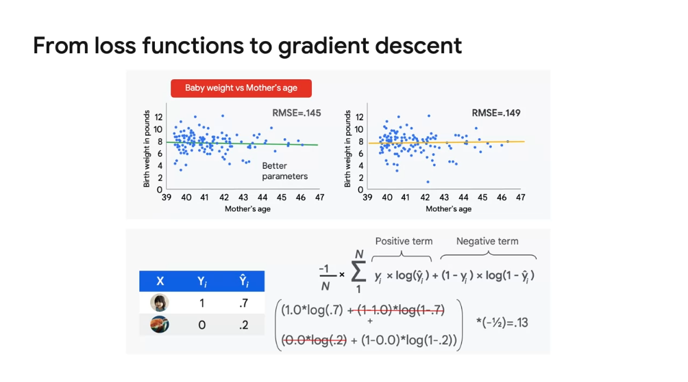
</p>

### Gradient Descent
In this section on optimization, we learn about the concept of gradient descent, which is a search strategy used to find the minimum of a loss function. We start by understanding that optimization is like searching in parameter space using the loss function as a guide. However, we only have limited information about the loss values at the points we have evaluated. 

To find the minimum, we need to answer two important questions: **which direction should we head, and how far should we step?** For now, we simplify the process by using a fixed-size step. We compute the direction and update each parameter in the model by adding the product of the step size and the direction. We then recompute the loss.

The algorithm takes fixed-size steps in the direction of the minimum. If the step size is too small, the training might take a long time. If it's too big, we might bounce from wall to wall or even end up in a different part of the loss surface. **The step size needs to be just right for each problem**.

Thankfully, the slope of the curve gives us an idea of how far to step and in which direction. A larger slope indicates that we are farther away from the bottom, and a negative slope means the bottom is to the right. We can use this information to update our algorithm and take steps in the right direction with the appropriate step size.

However, it's important to note that the basic algorithm of gradient descent may not always perform well in practice. It can take a long time to find sub-optimal minima or may not finish at all. This doesn't mean the algorithm doesn't work, but rather that it may not excel in certain problem scenarios.

<p style="text-align: center;">
  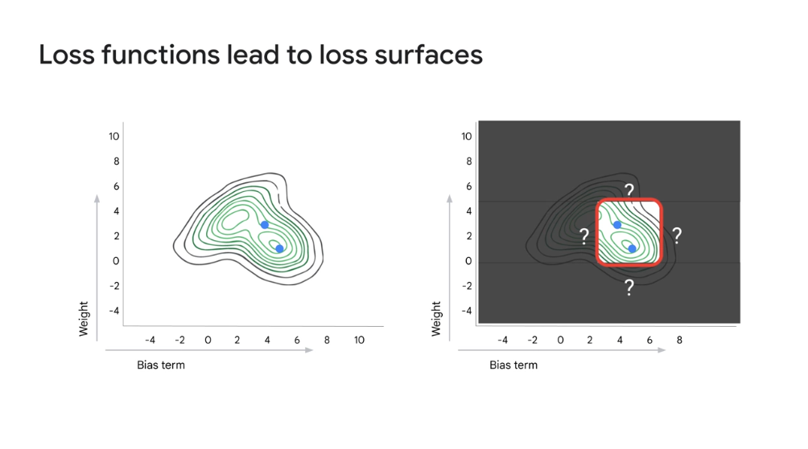
  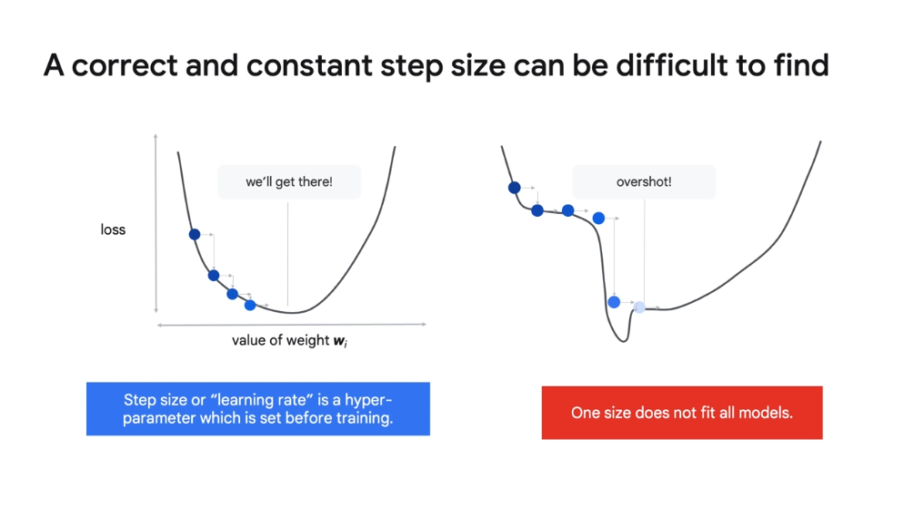
  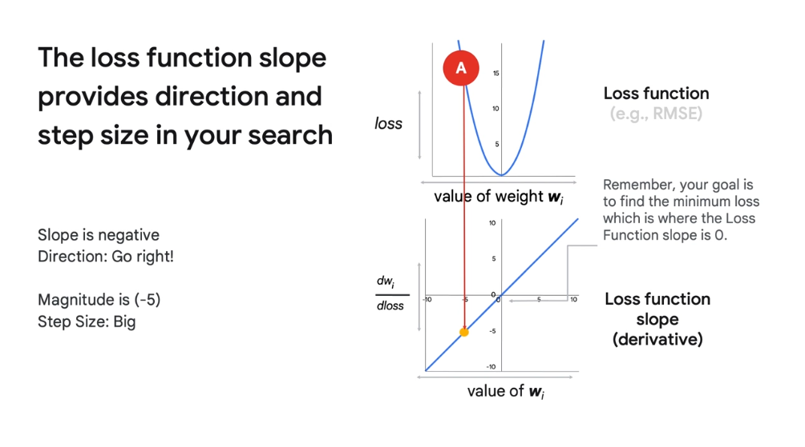
</p>

### Troubleshooting loss curves
This section of the course focuses on troubleshooting loss curves in machine learning. It discusses the **common shapes of loss curves** and what they indicate about the model's progress. It introduces the concept of a **learning rate**, which is a scaling parameter that affects the step size in gradient descent. The learning rate is a hyperparameter that needs to be set before training begins. The section also mentions hyperparameter tuning as a method to determine the best value for the learning rate. Overall, this section emphasizes the importance of understanding loss curves and choosing an appropriate learning rate for effective model training.

<p style="text-align: center;">
  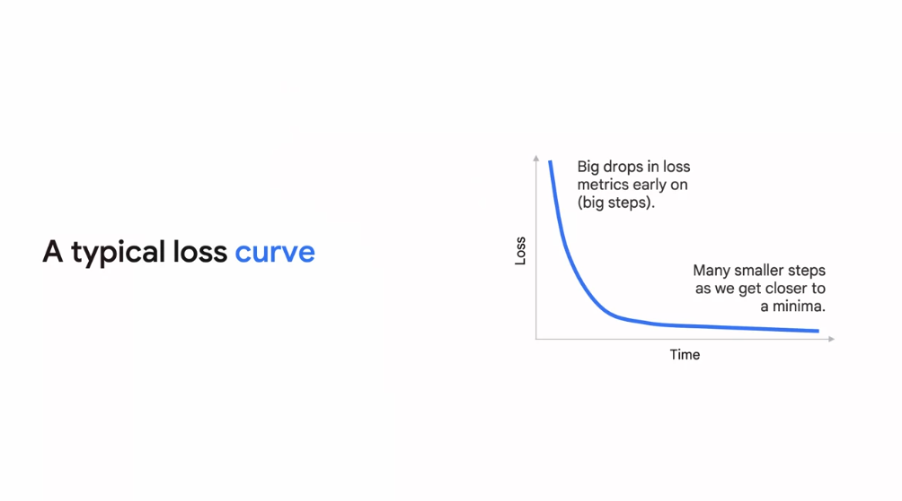
  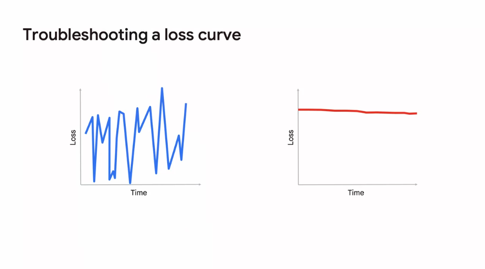
</p>

### ML Model pilfalls
INTRODUCTION: In machine learning, re-running model code may not always produce the same output due to non-deterministic settings. This is because the loss surfaces in ML models can vary, with some having multiple minima.

CONVEXITY: Loss surfaces can be convex or non-convex. Convex surfaces have a single bottom, while non-convex surfaces have multiple minima. Multiple minima mean there are equivalent points in parameter space that produce models with similar predictive capacity.

TRAINING TIME OPTIMIZATION: To make model training faster, we can adjust two factors: **the number of data points used for derivative calculation and the frequency of checking the loss.**

MINI-BATCH GRADIENT DESCENT: By using mini-batches, we can reduce the number of data points fed into the loss function at each iteration. This technique balances out the samples and is known as mini-batch gradient descent. It also saves time, memory, and can be easily parallelized.

BATCH SIZE: The size of mini-batches, also known as batch size, is an important hyperparameter. It can vary between 10 and 1,000 examples, depending on the problem and can be found using hyperparameter tuning.

REDUCING LOSS FUNCTION EVALUATION: Checking the loss function at every pass is time-consuming. By reducing the frequency of loss function evaluation, we can speed up training. Strategies like time-based or step-based evaluation can be used.

DECOPULING MODEL PARAMETER CHANGES AND LOSS CHECKING: With mini-batch gradient descent and reduced loss function evaluation frequency, we decouple the two fundamental parts of model training: changing model parameters and checking for the right changes.

By optimizing these factors, we can improve the training time of machine learning models without compromising accuracy.

<p style="text-align: center;">
  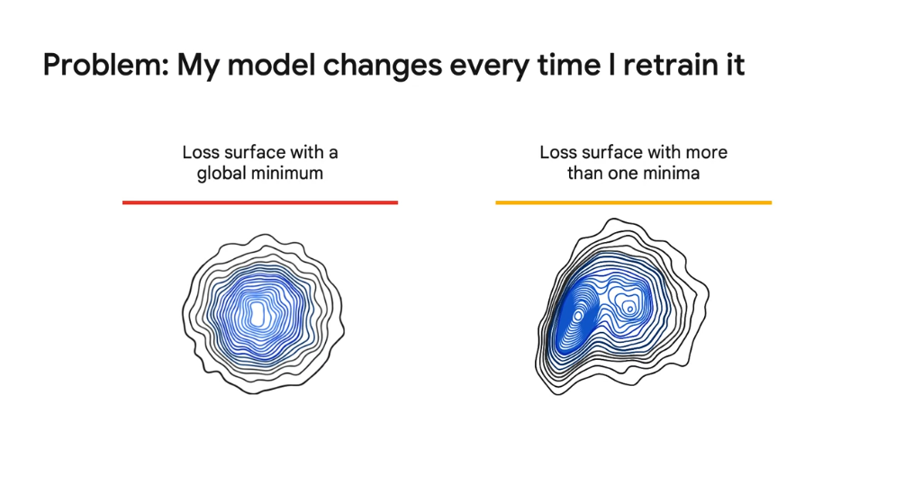
  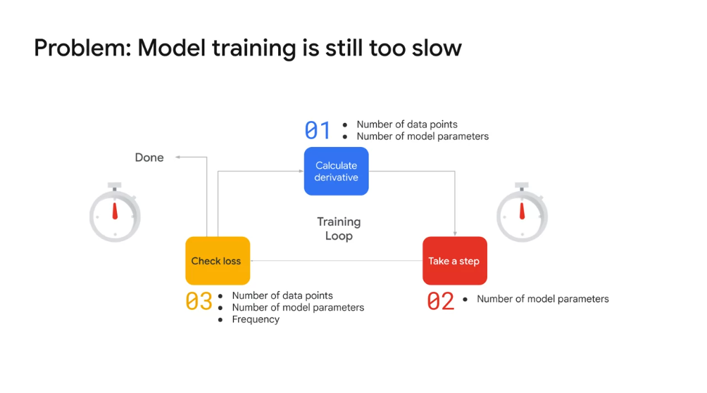
  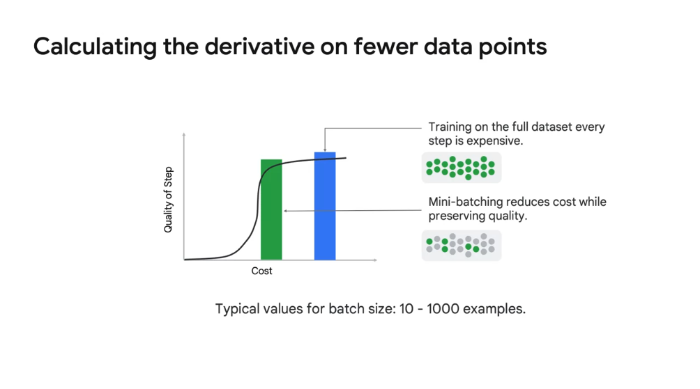
</p>

### Lecture Lab: Introduction trhe TensorFlow Playground
This section of the course introduces the TensorFlow Playground tool, which is a powerful tool for visualizing how neural networks work. It explains that even though neural networks haven't been introduced yet, the simplest neural networks are mathematically equivalent to linear models, making the tool suitable for experimenting and verifying theoretical concepts. The interface of the tool is described, including the features column, hidden layers column, and output column. The top control bar and data column are also explained. The section then guides learners through training a linear model to classify data and demonstrates the impact of different learning rates on the model's performance. The results of the experiments are discussed, highlighting the relationship between learning rate, weight magnitude, and loss curve steepness. Overall, this section provides hands-on experience with the TensorFlow Playground tool and reinforces the concepts learned in the course.

<p style="text-align: center;">
  
</p>

### Lecture Lab
### Lecture Lab
### Performance metrics
In this section of the course, we explore the problems that can arise when training models using gradient descent. We learn about inappropriate minima, which are points in parameter space that reflect strategies that won't generalize well or don't reflect the true relationship being modeled. We also discuss the limitations of loss functions and the need for performance metrics to evaluate models after training. **Performance metrics are easier to understand and directly connected to business goals**. We review three performance metrics: confusion matrices, precision, and recall, and discuss when to use them.

### Confusion matrix

This section of the course focuses on optimization in machine learning. Here are the key points covered:

1. ML Models and Optimization: ML models are sets of parameters and hyperparameters that need to be optimized. Optimization is framed as a search in parameter space.

2. Loss Functions: Loss functions quantify and evaluate the performance of a model during training. Two examples of loss functions discussed are RMSE for linear regression and cross-entropy for classification tasks.

3. Gradient Descent: Gradient descent is a process used to traverse loss surfaces efficiently. It involves analyzing the slopes of loss functions to determine the direction and step magnitude.

4. Experimenting with ML Models: TensorFlow Playground was used to experiment with different ML models. It was observed that linear models can learn non-linear relationships with non-linear features, and neural networks can learn hierarchies of features.

5. Hyperparameters: Hyperparameters like learning rate and batch size affect gradient descent. Choosing the right hyperparameters is crucial for model optimization.

6. Model Performance Metrics: Accuracy, precision, and recall are metrics used to evaluate classification model performance. The choice of metric depends on the problem being solved.

7. Labeled Training Dataset: The labeled training dataset is essential for the model to learn from. It serves as the driving force behind model optimization.

In the next module, the course will cover how to effectively split the full dataset into training and evaluation sets and the pitfalls to avoid in the process.

<p style="text-align: center;">
  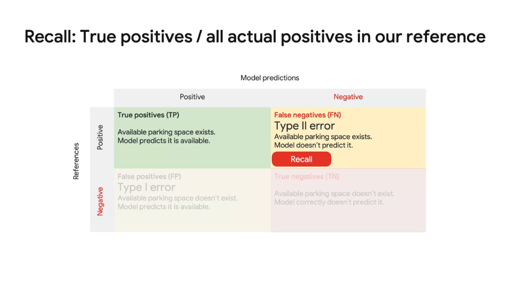
  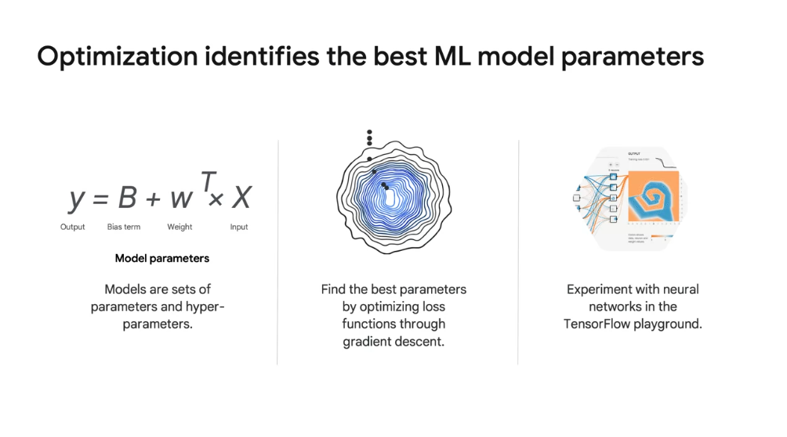
</p>

### Reading
- [Introduction to lineal regression](https://genomicsclass.github.io/book/pages/intro_using_regression.html)
- [Linear models](https://www.sciencedirect.com/topics/mathematics/linear-models)
- [How to chosse a machine learning model](https://www.datasciencecentral.com/profiles/blogs/how-to-choose-a-machine-learning-model-some-guidelines) 
- [How to choose a loss functions when training a DL NN](https://machinelearningmastery.com/how-to-choose-loss-functions-when-training-deep-learning-neural-networks/)
- [4 common pillfas in putting a machine learining model in production](https://www.topbots.com/pitfalls-in-putting-ml-model-in-production/)
- [Performance metrics](https://www.sciencedirect.com/topics/computer-science/performance-metric)
- [Understanding confusion metric](https://towardsdatascience.com/understanding-confusion-matrix-a9ad42dcfd62)


## Module 7: Generalization and sampling
Now it’s time to answer a rather weird question: when is the most accurate ML model not the right one to pick? As we hinted at in the last module on Optimization -- simply because a model has a loss metric of 0 for your training dataset does not mean it will perform well on new data in the real world. You will learn how to create repeatable training, evaluation, and test datasets and establish performance benchmarks.
Learning Objectives
Identify ways to assess if your model is overfitting.
Gauge when to stop model training
Explain how to create repeatable training, evaluation, and test datasets.
Establish performance benchmarks.

### Introduction
In this module on generalization and sampling, we explore the concept of model performance beyond just the training dataset. We learn that the most accurate ML model may not necessarily be the best choice for real-world applications. The main concern is how well the model performs on unseen data. To evaluate model performance, we need to create a separate evaluation dataset that the model has not seen during training. We also learn about overfitting and how to determine when to stop model training. Additionally, we discover how to create repeatable training, evaluation, and test datasets to establish performance benchmarks.

### Generalization and ML models

We then discuss the issue of overfitting, where a more complex model with more parameters can memorize the training dataset but fail to generalize well to new data. To assess the quality of a model, we need to evaluate its performance on a new dataset that it hasn't seen before. We split the original dataset into training and validation datasets and compare the model's performance on both. If the model's performance starts to degrade on the validation dataset, it indicates overfitting, and we should stop training.

We also learn about underfitting, where a model is too simplistic and fails to capture the relationships in the data. Finding the right level of model complexity is crucial for achieving good generalization. We use the validation dataset to determine if the model parameters are leading to overfitting and adjust the complexity accordingly.

<p style="text-align: center;">
  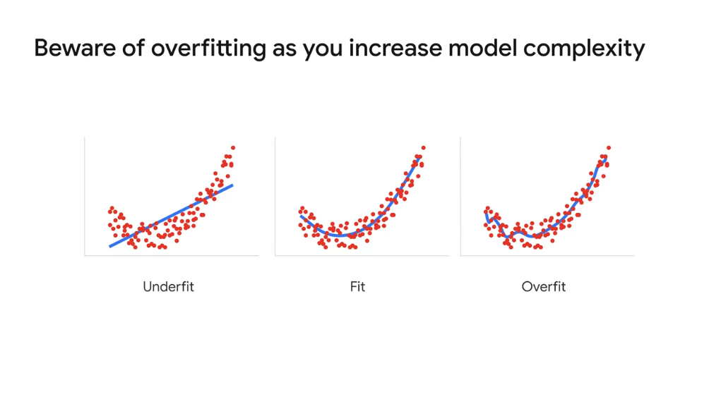
</p>

### When to stop model training
In this section of the course, we learn about the importance of using a validation dataset to fine-tune the hyperparameters of a machine learning model. We start by understanding how the **validation dataset** is used after the model training process. We use the validation dataset to assess the performance of our model against data it has not seen during training. If there is no significant difference between the loss metrics from the training run and the loss metric for the validation dataset, we can continue to optimize and tune the model. We can adjust the hyperparameters and try another training run to improve the model's performance. We also learn that we can use a similar process to figure out model parameters, such as the number of layers or nodes in a neural network. 

Once the model training and validation are complete, we need to evaluate the model's performance on a completely independent **test dataset**. This test dataset is used to report the final loss metric to our boss and determine whether to use the model. If the model fails to perform well on the test dataset, we need to either create and train a new model or collect more data samples for the original dataset. It is better for the model to fail in the final test than after it has been put into production.

To make the most of our data, we can use a technique called **bootstrapping or cross-validation**. This involves splitting the data into training and validation sets multiple times, training the model, and computing the validation loss metric each time. By averaging all the validation loss metrics and calculating the standard deviation, we can get a better understanding of the model's performance. This approach allows us to use all the data but requires training the model multiple times.

In summary, if we have a large amount of data, it is recommended to have a completely independent test dataset. However, if we have limited data, we can use cross-validation to make the most of the available data.

<p style="text-align: center;">
  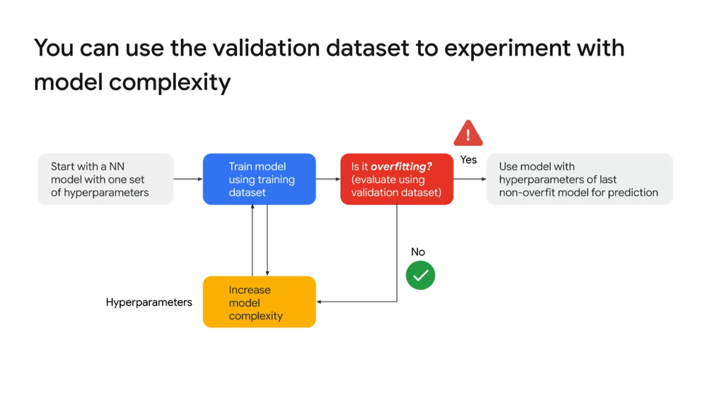
  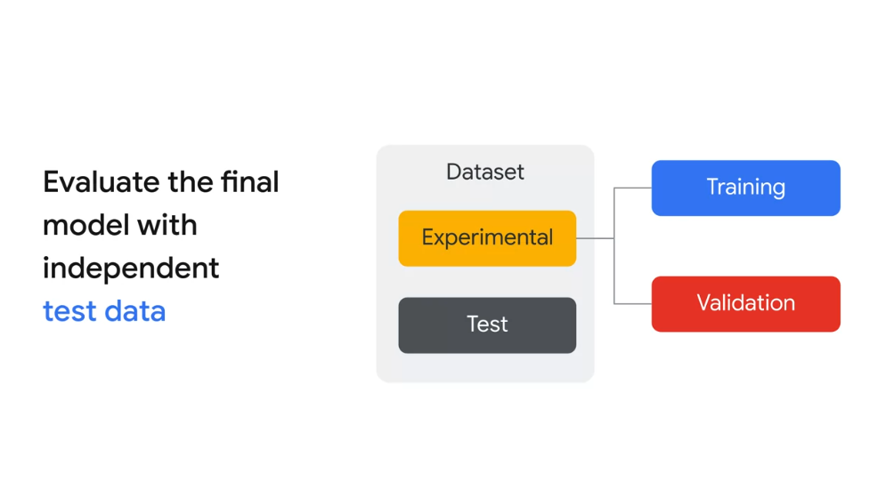
</p>

### Creating repeatable samples in BigQuery
In this section of the course, we learn about the importance of splitting our dataset for testing our machine learning models. We explore different methods for dividing the dataset and ensuring that the split is repeatable. One approach is to use a **hash function**, such as **Farm fingerprints**, to generate a unique value for each data point. This allows us to consistently assign data to different buckets, such as training, validation, and testing. We also discuss the considerations for choosing the field to split the dataset on, such as date or airport name. Additionally, we learn about the benefits of working with a smaller subset of data during the model development phase, as it allows for quicker iteration and debugging. Finally, we explore how to uniformly sample a smaller subset of the dataset using modulo operations.

### Demo: Splitting datasets in BigQuery
In this section of the course, we learn about how to split datasets into buckets using SQL in Google BigQuery. The goal is to make the dataset smaller in a repeatable fashion, rather than using naive random sampling. We start by filtering the dataset to include only 1-2% of the total records using modulo operators. Then, we further split the dataset into training, validation, and testing sets. The training set consists of 70% of the filtered data, while the validation set is 50% of the training set. Finally, we reserve 25% of the training set for testing. The process involves using hash functions and filtering operations in SQL. It's important to have a well-distributed dataset to avoid issues with identical hashes. The lecture provides code examples and explains the steps in detail.
```sql
SELECT
  date,
  ABS(FARM_FINGERPRINT(date)) AS date_hash,
  MOD(ABS(FARM_FINGERPRINT(date), 70)) AS remainder_divide_by_70,
  MOD(ABS(FARM_FINGERPRINT(date), 700)) AS remainder_divide_by_700,
  airline,
  departure_airport,
  departure_schedule,
  arrival_airport,
  arrival_delay
FROM
  `bigquery-samples.airline_ontime_data.flights` #70 588 485 rows
WHERE
  --# Pick 1 in 70 rows (where hash / 70 leaves no remainder) 
  MOD(ABS(FARM_FINGERPRINT(date)),70) = 0 # 842,634 rows (~1.19% of total 70M rows)

  --# Now lets ignore 50% of that new subset
  --# 350/700 = 50% so anything between 0 and 350 is ignored and 351 - 700 is kept (50%)
  AND
  MOD(ABS(FARM_FINGERPRINT(date)),700) >= 350 # 367,710 rows (~43.6% of 842k subset)

  --# And further split that new subset to only include 350 - 524 (midpoint to 700)
  --# Midpoint: ((700-350)/2)+350 = 525
  AND
  MOD(ABS(FARM_FINGERPRINT(date)),700) <= 525 # 211,702 rows (~57.5% of 367k subset or 25.1% of 842k)

```

### Reading
- [When to stop training your neural network](https://medium.com/@pranoyradhakrishnan/when-to-stop-training-your-neural-network-174ff0a6dea5)
- [Generalization, Regularization, Overfitting, Bias and variance in machine learning](https://towardsdatascience.com/generalization-regularization-overfitting-bias-and-variance-in-machine-learning-aa942886b870)

## Module 8: Summary
This module is a summary of the Launching into Machine Learning course
Learning Objectives
Describe the key takeaways from course's modules

